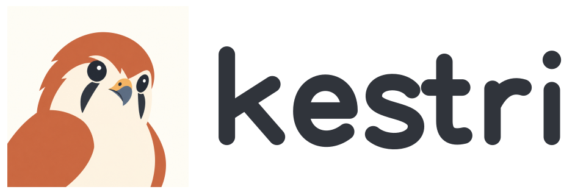

# Kestri

<picture>
  <source media="(prefers-color-scheme: dark)" srcset="design/brand/assets/kestri-logo-dark.svg">
  
</picture>

[简体中文](README.zh-CN.md)

Kestri is a local personal AI agent, accessible through a Telegram bot. It is intended to help with everyday questions, information research, personal preferences, and explicitly delegated recurring tasks.

The name comes from **kestrel**, represented by Kestri's curious little bird mascot. The [visual identity guide](design/brand/README.md) provides the official logo, mascot, avatar, and usage guidelines in SVG and PNG formats.

## Project status

**The first version (M0–M4) is implemented.** Public research and follow-up, daily/weekly briefings, explicit personal memory, automatic context compression, and local retention, export, backup, and conservative restore are available. Tool limits, cancellation, durable recovery, and usage estimates accompany these workflows.

Start with [Telegram setup](docs/tutorials/telegram-research.md), then [recurring briefings](docs/tutorials/recurring-briefing.md) and [personal memory](docs/tutorials/personal-memory.md). Use the [operations guide](docs/how-to/operate-local-agent.md) and [backup/restore guide](docs/how-to/backup-and-restore.md). The [first-version acceptance record](docs/development/first-version-acceptance.md) separates controlled tests, live APIs/Telegram, deployed containers, and the session trial; long-term daily use is recorded separately. [Milestones](docs/development/milestones.md) preserve delivery criteria.

## Goals

- Learn agent application development and engineering practices through a usable product.
- Build an assistant the project owner wants to use regularly.
- Provide a demonstrable engineering project for job applications and technical interviews.

## First-version direction

The first version focuses on three connected workflows:

1. Research a question using public web sources and continue discussing the findings.
2. Create and manage a recurring news briefing delivered in the same Telegram chat.
3. Explicitly save, inspect, update, and forget personal preferences or facts.

A news briefing is the first acceptance scenario for reusable information tools. Kestri's product scope remains a general personal agent.

## Selected technologies

| Area | Selected direction |
| --- | --- |
| Application | Python 3.14, LangChain Agent, underlying LangGraph persistence and execution control |
| Model provider | DeepSeek official API |
| Interaction | Telegram private chat, long polling, configured user-ID allowlist |
| Web information | Tavily Search and Extract behind Kestri-owned tools |
| Persistence | Local PostgreSQL and a dedicated filesystem workspace |
| Deployment | Docker Compose for the application and database |
| Initial tool policy | Controlled tools; arbitrary code execution deferred |

Local operation means the application and its durable data run locally. Model requests, web retrieval, and Telegram messaging use external services. Data processing boundaries are described in the [security and data design](docs/design/security-and-data.md).

## Documentation

Start with the [implementation guide](docs/development/implementation-guide.md) to locate each module/method and its detailed design.

Start with the [documentation guide](docs/README.md). For implementation study, read [software architecture](docs/design/architecture.md), [database structure](docs/reference/database.md), [context management](docs/design/context-management.md), and [tool design](docs/design/tools.md) in that order. Each explains implemented behavior and links to the responsible source and tests. Product, requirements, security/data policy, and architecture decisions provide the surrounding rationale.

English is the primary documentation language. Every English document has a corresponding Simplified Chinese translation, with matching scope, status, and identifiers.
