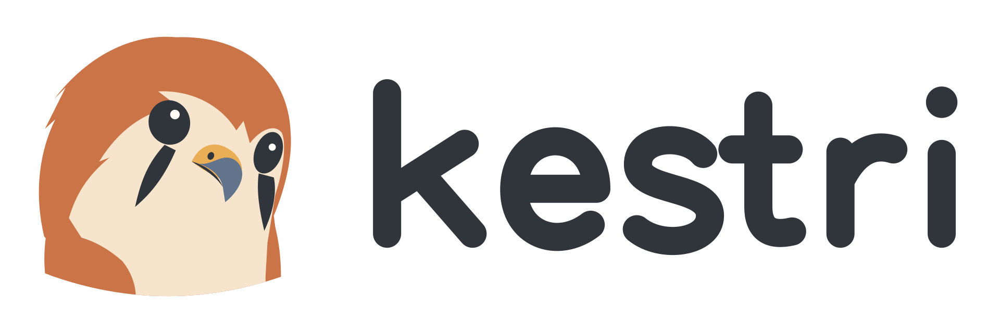

<p align="center">
  <picture>
    <source media="(prefers-color-scheme: dark)" srcset="design/brand/assets/kestri-logo-dark.png">
    
  </picture>
</p>

<p align="center">
  <strong>帮你研究信息、记住偏好、跟进持续任务的个人 agent。</strong><br>
  <sub>在本地运行，通过 Telegram 交互，让偏好和任务约定跨越每一次对话。</sub>
</p>

<p align="center">
  <a href="https://github.com/jslee124/kestri/actions/workflows/checks.yml"></a>
  
  
  
</p>

<p align="center">
  <a href="#快速开始">快速开始</a> ·
  <a href="#kestri-能做什么">功能</a> ·
  <a href="#日常使用">日常使用</a> ·
  <a href="docs/design/security-and-data.zh-CN.md">数据与安全</a> ·
  <a href="docs/README.zh-CN.md">文档</a>
</p>

<p align="center">
  <a href="README.md">English</a> ·
  <a href="README.zh-CN.md">简体中文</a>
</p>

Kestri 是一个本地运行的个人 AI agent，帮助你处理日常问题、信息研究、
个人偏好，以及明确委托的持续任务。它运行在你自己的电脑上，通过仅限
配置所有者的 Telegram 私聊提供服务。

项目希望做出一个值得长期使用的个人助理，同时学习和展示 agent 应用的
工程实践。产品定位是通用个人 agent，新闻简报是其中一个实际使用场景。

## Kestri 能做什么

| 能力 | 可以帮你做什么 |
| --- | --- |
| **带来源的信息研究** | 提出问题、检索公开网页，并在同一聊天中继续追问。 |
| **个人记忆** | 保存、查看、更正和忘记偏好，通过受管理的上下文继续对话。 |
| **持续简报** | 以明确的时间、时区和任务约定，委托每日或每周研究。 |
| **执行控制** | 查看运行和费用估算，取消正在执行的工作，开始新的对话上下文。 |
| **持久状态** | 重启后保留已完成结果、对话历史、个人记忆和任务约定。 |
| **数据维护** | 管理保留期、导出本地数据、创建备份，并进行保守恢复。 |

从[信息研究](docs/tutorials/telegram-research.zh-CN.md)、
[个人记忆](docs/tutorials/personal-memory.zh-CN.md)或
[持续简报](docs/tutorials/recurring-briefing.zh-CN.md)开始了解。

## 快速开始

需要 **Python 3.14**、[uv](https://docs.astral.sh/uv/)、支持 Compose 的 Docker，
以及 DeepSeek、Tavily 和 Telegram bot 的访问配置。

准备一个新的源码目录：

```sh
git clone https://github.com/jslee124/kestri.git
cd kestri
uv sync --locked
cp .env.example .env
chmod 600 .env
```

启动前先完成 [Telegram 设置指南](docs/tutorials/telegram-research.zh-CN.md)，
按步骤配置 API 密钥、机器人 token、所有者 ID，以及 PostgreSQL 密码和连接地址。
如果已有本地 `.env`，编辑该文件，不要覆盖。

使用本地 Python 开发运行方式：

```sh
docker compose -f compose.yaml -f compose.dev.yaml up -d postgres
uv run kestri telegram
```

容器部署见[运行指南](docs/how-to/operate-local-agent.zh-CN.md)。
已有向量数据库的安装请使用
[Memory v2 部署指南](docs/how-to/deploy-memory-v2.zh-CN.md)。

## 日常使用

打开机器人的私聊，从一个小请求开始：

```text
用公开资料研究一个话题，附上实际读取的来源链接，
并说明哪些结论属于你的推断。
```

然后保存一条偏好：

```text
/remember 我希望回答简短，并附上来源链接。
```

委托持续简报时，指定时间和时区：

```text
每天 08:00 Asia/Shanghai 给我 AI 和科技新闻简报：
最多三项，每项两句话，并附来源链接。
```

查看返回的任务约定。通过 Telegram 可折叠的命令菜单选择操作，
也可以直接输入：

| 命令 | 用途 |
| --- | --- |
| `/memory` | 查看已保存的个人记忆 |
| `/tasks` | 列出持续任务约定 |
| `/status` · `/runs` | 查看当前工作与运行结果 |
| `/usage` | 查看本地用量和费用估算 |
| `/stop` | 取消正在执行的前台工作 |
| `/new` | 开始新上下文，保留记忆、任务和历史 |
| `/help` | 查看可用命令 |

## 工作方式

| 层次 | 实现 |
| --- | --- |
| Agent | Python 3.14、LangChain Agent、LangGraph 执行与持久化 |
| 模型 | DeepSeek 官方 API |
| 研究 | Kestri 自有工具封装 Tavily Search 和 Extract |
| 交互 | Telegram 私聊、长轮询、配置好的所有者白名单 |
| 存储 | 本地 PostgreSQL 与专用文件工作区 |
| 部署 | Docker Compose 运行应用与数据库 |
| 工具策略 | 受控工具；任意代码执行后续再加入 |

应用和持久数据在本地运行，模型请求、网页检索和 Telegram 消息仍使用外部服务。
电脑休眠、网络中断或应用停止会延迟定时工作。数据处理边界见
[安全与数据设计](docs/design/security-and-data.zh-CN.md)，重启和恢复行为见
[运行指南](docs/how-to/operate-local-agent.zh-CN.md)。

## 项目状态

**第一版（M0–M4）已实现。** 信息研究与追问、持续简报、显式个人记忆、
自动上下文压缩和数据维护均可用。记忆功能的后续改进见
[Memory v2 完成记录](docs/development/memory-v2-completion.zh-CN.md)。

[第一版验收记录](docs/development/first-version-acceptance.zh-CN.md)区分受控测试、
真实 API 和 Telegram 检查、部署及单次流程试用。长期实用性和服务商质量仍是
独立的评估问题。[里程碑](docs/development/milestones.zh-CN.md)保留交付历史。

## 文档

| 目标 | 阅读入口 |
| --- | --- |
| 设置与使用 Kestri | [Telegram 设置](docs/tutorials/telegram-research.zh-CN.md) |
| 运维与保护本地数据 | [运行指南](docs/how-to/operate-local-agent.zh-CN.md) · [备份恢复](docs/how-to/backup-and-restore.zh-CN.md) |
| 理解实现 | [实现阅读地图](docs/development/implementation-guide.zh-CN.md) · [软件架构](docs/design/architecture.zh-CN.md) |
| 学习存储、上下文与工具 | [数据库](docs/reference/database.zh-CN.md) · [上下文](docs/design/context-management.zh-CN.md) · [工具](docs/design/tools.zh-CN.md) |
| 检查改动 | [验证指南](docs/how-to/run-checks.zh-CN.md) |
| 使用标志与吉祥物 | [视觉规范](design/brand/README.zh-CN.md) |

[文档索引](docs/README.zh-CN.md)列出完整阅读路线。[英文文档](README.md)均有
对应的简体中文版本，范围、状态和工程标识符保持一致。

名称来自 **kestrel（红隼）**，以项目中的小红隼作为吉祥物。
