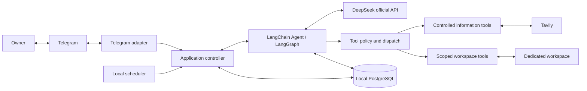

# Architecture design

[简体中文](architecture.zh-CN.md) · [Documentation](../README.md)

Updated: 2026-10-01. Status: design draft; major technology and boundary decisions accepted. M1 implements foreground research, controlled information tools, canonical records, checkpoints, delivery, and Compose. M2 implements durable task agreements and independent background scheduling; M3 implements explicit personal memory and budgeted context compression; see the [memory/context reference](../reference/memory-and-context.md). Exact implemented behavior is in the [M1 reference](../reference/telegram.md) and [validation record](../development/m1-validation.md).

## System boundary

Kestri runs its application and PostgreSQL locally through Docker Compose. Telegram is the first remote interface. DeepSeek handles model inference, and Tavily supplies search and extraction. Development may run Python directly; that mode must not be treated as proof of container isolation.

The diagram shows responsibilities, not separate processes or a permission grant. Model tool requests pass through application policy. The scheduler triggers the stored agreement; the model does not decide that a time event grants new authority.

## Responsibilities

| Component | Responsibility |
| --- | --- |
| Telegram adapter | Owner/chat authorization, inbound update identity, durable acceptance, message/reply association, status and result delivery |
| Application controller | Foreground ordering, run lifecycle, cancellation, permission scope, usage accounting, and delivery coordination |
| Agent runtime | Model/tool loop and middleware, main-thread continuity, independent task execution contexts |
| Tool policy and dispatch | Validate identity, task scope, arguments, paths/URLs, cancellation, and budgets before side effects |
| Information tools | Search and extract through a replaceable provider adapter, preserve provenance, bound output, and retain evidence |
| Memory service | Explicit writes and suggestions, scope/provenance, corrections/deletions, relevant retrieval |
| Task service and scheduler | Persist task agreements, decide due/catch-up execution, avoid duplicate local starts, handle pause/resume/delete |
| Persistence | Checkpoints, canonical message archive, memory, tasks, runs, delivery state, and evidence metadata |
| Workspace service | Task-scoped evidence and result files; no arbitrary host path access |

These are logical boundaries. The initial application need not become a collection of microservices. The package uses `src/kestri`. M1 separates `telegram.py`, `application.py`, `research.py`, `web.py`, `url_policy.py`, `workspace.py`, `budget.py`, and `store.py`; its schema is in `sql/001_initial.sql`. M2 adds `task_intent.py`, `task_agent.py`, `tasks.py`, `schedule.py`, and `sql/002_tasks.sql`. A local asynchronous loop uses PostgreSQL as schedule authority; see [ADR-0004](../decisions/0004-recurring-task-execution.md) and the [task reference](../reference/tasks.md). M3 adds `memory.py`, `context.py`, and `sql/003_memory_context.sql`; [ADR-0005](../decisions/0005-explicit-memory-and-revocable-context.md) explains context invalidation and the summarization extension.

LangChain provides an agent harness built on LangGraph, which supplies persistence and execution-control primitives. Kestri must still implement its application permissions, task lifecycle, and delivery behavior. See the [official framework overview](https://docs.langchain.com/oss/python/langchain/overview) and [ADR-0001](../decisions/0001-agent-stack.md).

## Execution flows

### Foreground research

1. Authorize and durably accept the Telegram update using its stable identity before acknowledging it as consumed.
2. Associate any reply with a known message/run and order accepted foreground work.
3. Seed a fresh run thread from the last completed checkpoint and include referenced result/evidence within the request budget. Inject current eligible memory into the model request and compress older state within the shared budget.
4. Run the agent. Each requested tool operation is checked and bounded before execution.
5. Save results and evidence references, coordinate delivery, and retain the message-to-run association.

Plain conversation can answer without web tools. A substantial query receives concise status; the user can request cancellation. M1 uses one research worker, an eight-request queue bound, and independent polling/delivery loops. `/stop` and reply controls are defined in the M1 reference.

### Recurring briefing

1. Persist the user's agreement, explicit timezone, instructions, missed-run policy, and active/paused state.
2. At a due time or eligible recovery event, claim one permitted run using durable task/run state.
3. Start an independent agent context with the current task agreement, rather than the full Telegram history; M3 supplies eligible global/task memory without changing the stored agreement.
4. Generate and persist the result; delivery consumes that saved result.
5. Record send success, failure, or uncertainty. A transport retry does not require repeating research.

Task pause affects future starts; cancellation targets an individual run. Background work has separate bounded concurrency so it does not monopolize foreground conversation. Values and restart treatment of in-flight work must be validated before release.

### Memory and follow-up

An explicit memory instruction is validated, stored with provenance/scope, and acknowledged. A suggested preference waits for acceptance. Corrections supersede older entries; forgetting excludes them from retrieval and re-extraction.

A reply to a briefing retrieves the referenced result and necessary evidence into the foreground context. It does not merge entire background execution histories. This enables “expand the second item” in one chat without creating one unbounded model transcript.

## State boundaries

| State | Purpose |
| --- | --- |
| Canonical messages | Original inbound and outbound content and association metadata, subject to retention |
| Checkpoints | LangGraph execution and conversation state, including compressed history |
| Personal memory | Durable, scoped user facts/preferences with provenance and deletion status |
| Task agreements | Explicit user authorization, schedule, timezone, content instructions, and lifecycle |
| Runs and delivery | Claimed occurrence, execution outcome, usage, saved result, and send status |
| Evidence and artifacts | Retrieved material, sources, truncation metadata, and generated files |

LangGraph distinguishes per-thread checkpoints from cross-thread stores. Neither substitutes for an independent original-message archive or structured business state. See [official persistence documentation](https://docs.langchain.com/oss/python/langgraph/persistence) and [ADR-0003](../decisions/0003-persistence-and-state-separation.md).

## External provider boundaries

Expose Kestri-owned search and extraction operations rather than leaking provider-specific APIs into task definitions. Tavily has distinct [Search](https://docs.tavily.com/documentation/api-reference/endpoint/search) and [Extract](https://docs.tavily.com/documentation/api-reference/endpoint/extract) endpoints; search discovers candidates, while extraction supplies material for evidence.

The application controls permitted queries/URLs, provider timeouts, metadata, and model-visible output. Search and extraction adapters must not make arbitrary network access or provider-generated summaries authoritative. The [security design](security-and-data.md) specifies the boundary.

DeepSeek official API is selected. The current suggested model identifier is `deepseek-flash`; M0 has live validation for its two-turn tool workflow in both thinking modes, recorded in [M0 evidence](../development/m0-validation.md). Other workflows require their own validation. Its official documentation advertises a 1M context window; this is provider capacity, not Kestri's active request budget. Provider facts were checked on 2026-09-30 and may change. See [DeepSeek documentation](https://api-docs.deepseek.com/quick_start/pricing/).

## Adjustable initial defaults

These values are starting points from the design discussion, not benchmark results or immutable requirements. Implemented M0 settings are defined in [configuration reference](../reference/configuration.md); M1 implements the input admission and local spending envelope, as specified in the [M1 reference](../reference/telegram.md). M2 implements six-hour coalescing catch-up; M3 implements bounded summarization and scoped memory.

| Setting | Initial value | Interpretation |
| --- | --- | --- |
| Model identifier | `deepseek-flash` | M0 default verified for its model/tool workflow |
| Active input budget | 128,000 tokens | Includes system prompt, tool definitions, memory, summaries, messages, and current tool material; reserve output separately |
| Compression trigger | Approximately 70% of input budget | Account for fixed overhead; do not assume middleware counts all request components |
| Experiment budget | USD 20 per month | Local estimated spending envelope for model and search use; not a predicted bill or provider-side hard cap |
| Briefing catch-up window | 6 hours | Per-task default; coalesce missed occurrences and skip outside the window |

M3 extends LangChain’s [summarization middleware](https://docs.langchain.com/oss/python/langchain/middleware/built-in#summarization) with budgeted provider calls and historical-data framing. [M3 evidence](../development/m3-validation.md) covers forced compression, correction preservation, original archives, and real DeepSeek behavior. The request estimate remains conservative and summary quality remains model-dependent.

The task timezone has no implicit default: use an explicitly configured owner timezone or clarify it. M0 defines model/tool/output/time limits and locked dependencies in its configuration reference. Foreground concurrency, spending reservations, and delivery uncertainty are implemented in M1. M2 implements one foreground and one background worker, with a five-second scheduling check against stored agreements. Retention and backup implementation remain open. No automatic model routing or managed agent server is selected for the first version.
