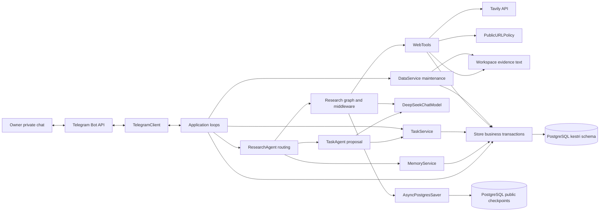
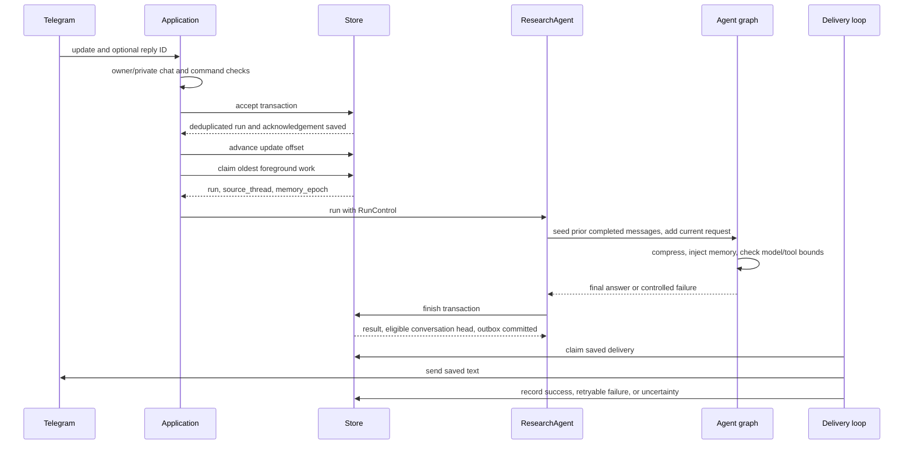

# Implemented software architecture

[简体中文](architecture.zh-CN.md) · [Documentation](../README.md)

Updated: 2026-10-02. Status: source-grounded description of the implemented first version. Values below are repository defaults, not provider guarantees or performance measurements. Historical decisions and acceptance evidence remain in the ADRs and development records.

See the [implementation guide](../development/implementation-guide.md) for module/method responsibilities and detailed topic entry points.

## System and deployment boundary

Kestri is one local asynchronous Python application and one PostgreSQL service. Telegram provides the owner interface; DeepSeek provides model inference; Tavily provides public search/extraction. LangChain `create_agent` builds the model/tool graph, and LangGraph checkpoint savers persist its execution state. Business authorization, scheduling, cancellation, accounting, and delivery remain Kestri responsibilities.

Boxes are responsibilities, not independent deployed services. There is no public application HTTP server, shell executor, autonomous tool installation, vector database, or distributed job broker in this version.

[compose.yaml](../../compose.yaml) puts PostgreSQL on an internal database network without a host port. The app joins that network and an outbound network, mounts a writable workspace, uses a read-only root filesystem and temporary `/tmp`, drops capabilities, and runs as UID/GID 10001 through [Dockerfile](../../Dockerfile). Both services have resource limits. The app healthcheck runs `kestri data status`: it checks local database access, not Telegram polling, successful inference, or end-to-end delivery. Direct Python development does not provide the container boundary.

## Entry points and module responsibilities

Start reading [cli.py](../../src/kestri/cli.py), then follow the appropriate route. The module named `runtime.py` is primarily the minimal integration session; the product execution path runs through `application.py` and `research.py`.

| Module | Main interface | Responsibility |
| --- | --- | --- |
| [cli.py](../../src/kestri/cli.py) | `main`, `run_data` | Parse `smoke`, `telegram`, `telegram-id`, and local `data` commands; select required settings |
| [settings.py](../../src/kestri/settings.py) | `Settings`, `ResearchSettings`, `DataSettings`, `TelegramCredentials` | Validate separate configurations for runtime, product, maintenance, and onboarding |
| [runtime.py](../../src/kestri/agent/runtime.py), [models.py](../../src/kestri/agent/models.py) | `build_model`, `AgentSession`, `DeepSeekChatModel` | Official-endpoint model construction; in-memory smoke graph; provider reasoning serialization adapter |
| [telegram.py](../../src/kestri/integrations/telegram.py) | `TelegramClient`, `authorized_message`, `command_for` | Bot API transport/menu, owner/private-chat checks, command recognition, send uncertainty |
| [application.py](../../src/kestri/application.py) | `run_telegram`, `Application` | Construct dependencies; run polling, execution, scheduling, delivery, and maintenance |
| [research.py](../../src/kestri/agent/research.py) | `ResearchAgent.run`, `BoundsMiddleware` | Route memory/task controls; otherwise build and execute research graph, enforce bounds, finalize result |
| [context.py](../../src/kestri/agent/context.py), [memory.py](../../src/kestri/memory/service.py) | `ContextSummary`, `MemoryContext`, `MemoryService` | Explicit facts, retrieval, epoch invalidation, temporary model injection, bounded compression |
| [task_intent.py](../../src/kestri/tasks/intent.py), [task_agent.py](../../src/kestri/tasks/agent.py) | `task_intent`, `TaskAgent.run` | Recognize direct recurring-task intent; extract one structured proposal without research tools |
| [tasks.py](../../src/kestri/tasks/service.py), [schedule.py](../../src/kestri/tasks/schedule.py) | `TaskService.apply`, `tick`, occurrence functions | Validate/persist agreements; daily/weekly timezone scheduling; missed-run policy and revisions |
| [web.py](../../src/kestri/integrations/web.py), [url_policy.py](../../src/kestri/integrations/url_policy.py) | `WebTools`, `PublicURLPolicy` | Public information tools, source records, URL checks, bounded model output |
| [workspace.py](../../src/kestri/storage/workspace.py), [http.py](../../src/kestri/integrations/http.py) | `Workspace`, `post_json` | Identifier-scoped evidence files and bounded HTTP JSON reads |
| [budget.py](../../src/kestri/agent/budget.py), [store.py](../../src/kestri/storage/store.py) | `RunControl`, `Budget`, `Store` | Revocation checks, conservative accounting, transaction-backed business state |
| [data.py](../../src/kestri/storage/lifecycle.py), [redaction.py](../../src/kestri/redaction.py) | `DataService`, `Redactor` | Operator backup/restore/retention; local content redaction |

Dependencies are explicit constructor arguments: model, saver, HTTP clients, store, workspace, and optional URL resolver. Tests inject mock transports and deterministic responses while exercising the real graph. `Store` owns SQL transactions; business services apply domain policy. This is a modular monolith, without an ORM or an additional generic repository interface.

## Startup and concurrency

`run_telegram()` opens business storage/migrations, creates separate Telegram/DNS/Tavily HTTP clients, fetches bot identity, rejects an existing webhook, acquires a bot advisory lease, binds the database identity, calls checkpoint saver setup, and configures the owner's menu. It then constructs `ResearchAgent` and `Application`.

`serve()` first handles the restore marker, then recovers interrupted records, then starts six tasks in one `asyncio.TaskGroup`:

| Loop | Responsibility | Coordination |
| --- | --- | --- |
| `polling()` | Long poll messages, authorize/accept, advance durable offset | Continues while model work runs; rate-limit/network delays handled locally |
| `working()` | Claim and run one non-background execution at a time | Foreground conversation, task controls, and memory controls share this worker |
| `working(background=True)` | Claim and run one recurring occurrence at a time | Separate from foreground worker |
| `scheduling()` | Convert due stored agreements into background runs | Default five-second tick; PostgreSQL remains schedule authority |
| `delivering()` | Send saved outbox contents | Ordered queue; 1.1-second pause after each attempt |
| `DataService.maintaining()` | Apply local retention | Default hourly; defers while runs or delivery are busy |

`wake_run` and `wake_delivery` are process-local wakeups, not durable work queues. Idle workers also recheck after one second; persisted rows survive lost wakeups. The default foreground and background queue limits are both 8; active/paused task count is bounded by default at 16. This is one foreground and one background worker, not one worker per task. An unhandled TaskGroup child failure tears down the other loops. SIGTERM cancels the application; process supervision uses Compose restart policy.

## End-to-end foreground request

Unauthorized messages are rejected before personal-state writes. Authorized duplicates do not create another run. Status commands are answered inside acceptance; ordinary input creates a run. Direct memory instructions take precedence over recurring-task intent; forwarded/external-reply messages do not become memory/task authorization.

At claim time, a foreground run receives the last completed conversation head and current memory epoch. Research creates a new graph thread for this run, copies prior messages if eligible, and appends the new request. A reply can additionally insert the referenced completed result plus at most 20 evidence references. It does not merge the entire background graph.

The graph alternates model decisions and fixed tools. `ResearchAgent` requires a final nonempty `AIMessage`, adds an application-generated source-status footer, bounds displayed text, redacts configured secrets, and calls `Store.finish()`. That transaction saves the outcome, classifies unresolved usage, promotes the head only for successful foreground work, and enqueues result chunks. Tool evidence may already have been retained during execution. Graph checkpoint writes and business completion are separate commits.

## Task and memory control paths

A task request is recognized before research. `TaskAgent` uses only the current request plus fixed extraction instructions and configured owner timezone. It supplies no research tools or old conversation; `ToolStrategy(TaskPlan)` produces a proposal with a two-model-call limit. `TaskService.apply()` rechecks direct intent, requested action, exact owner-supplied content, explicit schedule/timezone, target association, and active run state. It commits the agreement and `task_changes` acknowledgement together. A model proposal is not an authorization grant.

The scheduler locks owner/task state, finds the latest eligible daily/weekly occurrence, coalesces misses within six hours, skips expired occurrences, and writes one unique `(task_id, scheduled_for)` run. Claim rechecks task status/revision and catch-up deadline. Background research starts without a foreground source thread and uses the stored agreement and eligible global/task memory. Pausing/deleting a task prevents future starts; stopping an already active execution requires `/stop`.

Memory commands bypass model calls. `MemoryService.apply()` validates exact content and explicit target, records provenance, and commits a `memory_changes` acknowledgement. A successful change clears the conversation head and increments `memory_epoch`; in-flight old context cannot start further billable operations or restore the head. See [context management](context-management.md).

## Completion, retry, and recovery

| Situation | Implemented response |
| --- | --- |
| Foreground inference/tool failure | Save a safe terminal outcome; do not automatically research again; keep prior completed head |
| Selected transient background provider failures | At most one extra attempt after 30 seconds if task remains active at the same revision; fresh graph thread; shared run/cost ledger |
| `/stop` | Persist cancellation and cancel matching active asyncio task; submitted remote requests may still complete or bill |
| Task/memory mutation committed before final reply | Use run-keyed change acknowledgement to report committed behavior; restart does not apply it again |
| Process stops with running research | Mark `interrupted` on recovery; do not auto-resume checkpoint or research |
| Saved pending delivery | Continue using saved content; no model regeneration |
| Known failed delivery | Retry saved content within the attempt bound; a run's success state is independent |
| Delivery response or crash leaves outcome unknown | Mark `uncertain`; no automatic resend that could duplicate a delivered message |
| Restore | Empty-target import; quarantine memory, pause agreements, reset checkpoints, stop unfinished work, suppress stale pending updates |

There is no transaction spanning PostgreSQL, Telegram, model APIs, Tavily, and disk. Local deduplication and conservative recovery narrow risks; they do not prove exactly-once remote side effects or lossless graph recovery.

## Resource, data, and provider boundaries

Research defaults: 8 model calls, 8 tool calls, 120-second run timeout, 30-second provider timeout, 4096 output tokens, 128,000 local input admission units, 12,000-character tool output and reply bodies. Summaries have a separate call count but share run timeout and spending. USD 0.50/run and USD 20/month are local configured estimates, not current provider prices or provider-enforced spending caps. Exact settings live in [settings.py](../../src/kestri/settings.py) and the references.

`build_model()` fixes the DeepSeek API base URL and disables SDK retries. `DeepSeekChatModel` preserves `reasoning_content` during assistant-message replay; its protected SDK hook has regression tests. Research/summary/task agent calls disable cloud tracing. Tavily authentication stays in the injected HTTP client, not tool arguments. Local rows and files can contain private content despite redaction; checkpoint reasoning is excluded from logical backups.

Read [database](../reference/database.md) for fields and transactions, [context management](context-management.md) for prompt composition, [tool design](tools.md) for interfaces and checks, and [security and data](security-and-data.md) for policy. Defaults and framework protected hooks need revalidation when dependencies change.

## Verification and extension points

[Research integration tests](../../tests/agent/test_research_integration.py) cover acceptance, budgeting, checkpoints, cancellation, delivery, and recovery; [task tests](../../tests/tasks/test_tasks_integration.py) cover agreements/scheduling; [memory/context tests](../../tests/memory/test_memory_context_integration.py) cover compression/revocation; [data lifecycle tests](../../tests/storage/test_data_lifecycle_integration.py) cover backup/restore/cleanup. [Run checks](../how-to/run-checks.md) distinguishes offline/database checks from live services and remote CI.

To change a provider, inspect `build_model()` or the fixed endpoints in `WebTools`; a protocol alone does not establish equivalent provider behavior. To add a tool, follow the schema/policy/accounting/evidence rules in tool design. To change state, add migration and backup-compatibility decisions together. A future transport should authorize input before invoking the shared application services rather than bypassing their business policy. These are maintenance directions, not implemented plugin or multi-channel APIs.
