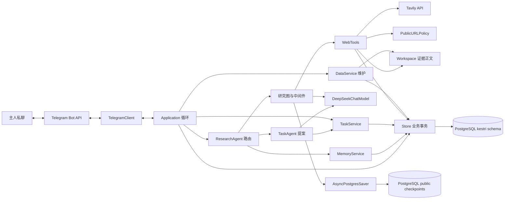
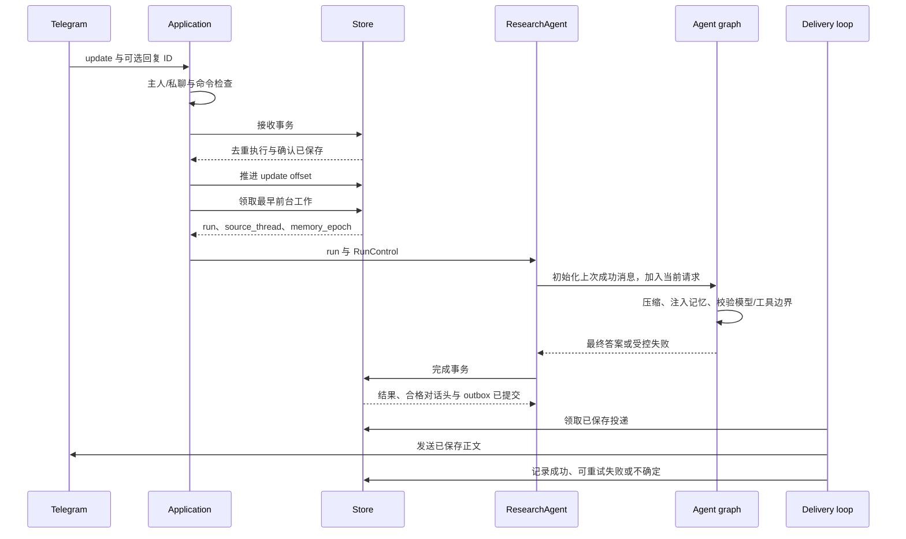

# 已实现的软件架构

[English](architecture.md) · [文档指南](../README.zh-CN.md)

更新：2026-10-02。状态：依据源码描述已实现的第一版。下方数值是仓库默认值，不是服务商保证或性能测量。历史决策和验收证据继续保留在 ADR 与开发记录中。

逐模块/方法职责及各专题的详细入口见[实现阅读地图](../development/implementation-guide.zh-CN.md)。

## 系统与部署边界

Kestri 是一个本地异步 Python 应用和一个 PostgreSQL 服务。Telegram 提供主人界面，DeepSeek 提供模型推理，Tavily 提供公共搜索与提取。LangChain `create_agent` 构建模型/工具图，LangGraph checkpoint saver 保存图执行状态。业务授权、调度、取消、计费和投递仍由 Kestri 负责。

方框表示职责，不是独立部署服务。当前没有公开应用 HTTP 服务、shell 执行器、自主安装工具、向量数据库或分布式任务队列。

[compose.yaml](../../compose.yaml) 将 PostgreSQL 放在不暴露主机端口的内部数据库网络。应用加入该网络和出站网络，挂载可写工作区，根文件系统只读，`/tmp` 临时可写，移除 capabilities，通过 [Dockerfile](../../Dockerfile) 以 UID/GID 10001 运行。两个服务都设资源限制。应用健康检查执行 `kestri data status`：检查本地数据库访问，不代表 Telegram 轮询、模型推理或完整投递成功。直接运行 Python 不提供容器边界。

## 入口与模块职责

先读 [cli.py](../../src/kestri/cli.py)，再沿对应路线阅读。`runtime.py` 主要是最小集成会话；产品执行路线经过 `application.py` 和 `research.py`。

| 模块 | 主要接口 | 职责 |
| --- | --- | --- |
| [cli.py](../../src/kestri/cli.py) | `main`、`run_data` | 解析 `smoke`、`telegram`、`telegram-id` 和本地 `data` 命令；选择所需配置 |
| [settings.py](../../src/kestri/settings.py) | `Settings`、`ResearchSettings`、`DataSettings`、`TelegramCredentials` | 分别校验运行、产品、维护和引导配置 |
| [runtime.py](../../src/kestri/agent/runtime.py)、[models.py](../../src/kestri/agent/models.py) | `build_model`、`AgentSession`、`DeepSeekChatModel` | 官方端点模型构造、内存 smoke 图、推理字段序列化适配 |
| [telegram.py](../../src/kestri/integrations/telegram.py) | `TelegramClient`、`authorized_message`、`command_for` | Bot API/菜单、主人与私聊检查、命令识别、发送不确定性 |
| [application.py](../../src/kestri/application.py) | `run_telegram`、`Application` | 构造依赖；运行轮询、执行、调度、投递与维护 |
| [research.py](../../src/kestri/agent/research.py) | `ResearchAgent.run`、`BoundsMiddleware` | 路由记忆/任务控制；否则构建研究图、执行限制并保存结果 |
| [context.py](../../src/kestri/agent/context.py)、[memory.py](../../src/kestri/memory/service.py) | `ContextSummary`、`MemoryContext`、`MemoryService` | 显式事实、检索、代次失效、临时模型注入、有界压缩 |
| [task_intent.py](../../src/kestri/tasks/intent.py)、[task_agent.py](../../src/kestri/tasks/agent.py) | `task_intent`、`TaskAgent.run` | 识别直接持续任务意图；无研究工具地提取一个结构化提案 |
| [tasks.py](../../src/kestri/tasks/service.py)、[schedule.py](../../src/kestri/tasks/schedule.py) | `TaskService.apply`、`tick`、occurrence 函数 | 校验/保存约定；每日/每周时区调度、错过策略与版本 |
| [web.py](../../src/kestri/integrations/web.py)、[url_policy.py](../../src/kestri/integrations/url_policy.py) | `WebTools`、`PublicURLPolicy` | 公共信息工具、来源记录、URL 检查、有界模型输出 |
| [workspace.py](../../src/kestri/storage/workspace.py)、[http.py](../../src/kestri/integrations/http.py) | `Workspace`、`post_json` | 标识限定的证据文件与有界 HTTP JSON 读取 |
| [budget.py](../../src/kestri/agent/budget.py)、[store.py](../../src/kestri/storage/store.py) | `RunControl`、`Budget`、`Store` | 撤销检查、保守计费、事务化业务状态 |
| [data.py](../../src/kestri/storage/lifecycle.py)、[redaction.py](../../src/kestri/redaction.py) | `DataService`、`Redactor` | 操作员备份/恢复/保留与本地内容脱敏 |

model、saver、HTTP client、store、workspace 和可选 URL resolver 都通过构造参数传入。测试注入模拟传输和确定性响应，同时执行真实图。`Store` 维护 SQL 事务，业务服务实施领域策略。当前是模块化单体，没有 ORM 或额外的通用 repository 接口。

## 启动与并发

`run_telegram()` 打开业务存储/迁移，创建独立 Telegram/DNS/Tavily HTTP client，读取 bot 身份，拒绝已配置 webhook，取得 bot advisory 租约，绑定数据库身份，执行 checkpoint saver setup，并配置主人菜单。随后构造 `ResearchAgent` 和 `Application`。

`serve()` 先处理恢复标记，再恢复中断记录，然后在一个 `asyncio.TaskGroup` 中启动六个任务：

| 循环 | 职责 | 协调方式 |
| --- | --- | --- |
| `polling()` | 长轮询消息，授权/接收，推进持久 offset | 模型执行期间继续；本地处理限流/网络等待 |
| `working()` | 每次领取一个非后台执行 | 前台会话、任务控制和记忆控制共享 worker |
| `working(background=True)` | 每次领取一个持续任务 occurrence | 与前台 worker 独立 |
| `scheduling()` | 将到期约定转成后台 run | 默认五秒 tick；数据库仍是调度权威 |
| `delivering()` | 发送已保存 outbox 正文 | 有序队列；每次尝试后暂停 1.1 秒 |
| `DataService.maintaining()` | 应用本地保留策略 | 默认每小时；执行或发送忙时延后 |

`wake_run` 和 `wake_delivery` 只是进程内唤醒，不是持久队列。空闲 worker 也会在一秒后重查；丢失唤醒不丢失数据库工作。默认前台/后台队列上限都为 8，active/paused 任务数量默认最多 16。并发为一个前台和一个后台 worker，不是每个任务独立 worker。TaskGroup 子任务未处理异常会结束其他循环。SIGTERM 取消应用；进程监督使用 Compose restart 策略。

## 前台请求完整链路

未授权消息在个人状态写入前拒绝。重复的授权更新不会再创建 run。状态命令在接收事务中回答，普通输入创建 run。直接记忆指令优先于持续任务意图；转发/外部回复不能成为记忆或任务授权。

领取时，前台 run 获得最近成功对话头和当前 memory epoch。研究为本次 run 创建新图 thread，按需复制旧消息，再加入新请求。回复还可插入被引用的已完成结果和最多 20 个证据引用，不会合并整个后台图。

图交替执行模型决策和固定工具。`ResearchAgent` 要求最终非空 `AIMessage`，添加应用生成的来源状态页脚，限制显示正文，脱敏配置秘密，然后调用 `Store.finish()`。该事务保存结果、分类未结算费用、仅对成功前台推进对话头，并写入结果分块。执行期间证据可能已经保存。图 checkpoint 写入与业务完成是不同提交点。

## 任务与记忆控制路线

任务请求在研究前识别。`TaskAgent` 只使用当前请求、固定提取指令和配置的主人时区，不提供研究工具或旧对话；`ToolStrategy(TaskPlan)` 在最多两次模型调用内生成提案。`TaskService.apply()` 再检查直接意图、动作、来自主人原文的内容、明确时间/时区、目标关联和执行状态，事务化提交约定与 `task_changes` 回执。模型提案不是授权。

调度器锁定主人/任务状态，查找最近有效的每日/每周 occurrence，在六小时内合并错过次数，跳过过期 occurrence，写入唯一 `(task_id, scheduled_for)` run。领取时再次检查任务状态/版本及补跑期限。后台研究没有前台 source thread，使用已保存约定和合格全局/任务记忆。暂停/删除任务阻止后续启动；已开始执行需用 `/stop` 停止。

记忆命令不调用模型。`MemoryService.apply()` 校验原样内容和明确目标，记录来源，提交 `memory_changes` 回执。成功变化清空对话头并递增 `memory_epoch`；正在执行的旧上下文不能发起后续计费操作或重新推进对话头。详见[上下文管理](context-management.zh-CN.md)。

## 完成、重试与恢复

| 情况 | 已实现行为 |
| --- | --- |
| 前台推理/工具失败 | 保存安全终态，不自动重新研究；保留上次成功对话头 |
| 指定的后台暂时性服务失败 | 任务仍有效且版本相同时，30 秒后最多再尝试一次；新图 thread，共用 run/费用账本 |
| `/stop` | 保存取消并取消对应 asyncio task；已提交远端请求仍可能完成或计费 |
| 任务/记忆变更提交但最终回复未完成 | 用 run 变更回执报告已提交行为；重启不重新应用 |
| 研究运行时进程停止 | 恢复标记 `interrupted`；不自动续跑 checkpoint 或研究 |
| 已保存的 pending 投递 | 使用已保存正文继续，不重新生成模型结果 |
| 已知投递失败 | 在尝试上限内重试已保存内容；run 成功状态独立 |
| 响应或崩溃导致发送结果未知 | 标记 `uncertain`；不自动重复发送可能已送达的消息 |
| 备份恢复 | 空目标导入；隔离记忆、暂停约定、重置 checkpoint、停止未完成工作、抑制陈旧待处理更新 |

PostgreSQL、Telegram、模型 API、Tavily 和磁盘之间没有统一事务。本地去重和保守恢复缩小风险，不能证明远端副作用恰好一次或图执行无损恢复。

## 资源、数据与服务边界

研究默认限制：8 次模型调用、8 次工具调用、120 秒执行超时、30 秒服务超时、4096 输出 token、128,000 本地输入准入单位、12,000 字符工具输出与回复正文。摘要单独计调用次数，但共享执行超时和费用。每次 USD 0.50、每月 USD 20 是本地配置的费用估算，不是当前服务商报价或服务商强制限额。准确配置见 [settings.py](../../src/kestri/settings.py) 和参考文档。

`build_model()` 固定 DeepSeek API base URL，禁用 SDK 重试。`DeepSeekChatModel` 在 assistant 消息重放时保留 `reasoning_content`；其 SDK 受保护接口有回归测试。研究/摘要/任务 agent 关闭云 tracing。Tavily 凭据位于注入的 HTTP client，不进入工具参数。脱敏后本地行和文件仍可能含私人内容；逻辑备份排除 checkpoint 推理字段。

字段和事务见[数据库](../reference/database.zh-CN.md)，提示组装见[上下文管理](context-management.zh-CN.md)，接口和检查见[工具设计](tools.zh-CN.md)，策略见[安全与数据](security-and-data.zh-CN.md)。依赖升级需要重新校验默认行为和框架受保护接口。

## 验证与扩展位置

[研究集成测试](../../tests/agent/test_research_integration.py)覆盖接收、预算、checkpoint、取消、投递和恢复；[任务测试](../../tests/tasks/test_tasks_integration.py)覆盖约定/调度；[记忆/上下文测试](../../tests/memory/test_memory_context_integration.py)覆盖压缩/撤销；[数据生命周期测试](../../tests/storage/test_data_lifecycle_integration.py)覆盖备份/恢复/清理。[运行检查](../how-to/run-checks.zh-CN.md)区分离线/数据库检查、真实服务与远端 CI。

替换服务商从 `build_model()` 或 `WebTools` 的固定端点入手；协议兼容本身不证明行为等价。添加工具遵循工具设计的 schema/策略/计费/证据规则。修改状态需同时添加迁移和备份兼容性决策。未来渠道应先授权输入，再调用共享业务服务，不能绕过业务策略。这些是维护方向，不是已实现的插件或多渠道 API。
