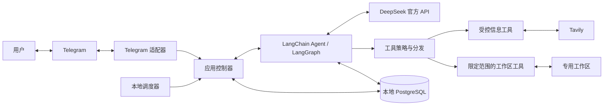

# 架构设计

[English](architecture.md) · [文档](../README.zh-CN.md)

更新日期：2026-10-01。状态：设计草案；主要技术和边界决策已确认。M1 已实现前台研究、受控信息工具、原始记录、checkpoint、发送及 Compose。M2 已实现持久化任务约定与独立后台调度；下方记忆和压缩仍待实现。准确实现行为见 [M1 参考](../reference/telegram.zh-CN.md)和[验证记录](../development/m1-validation.zh-CN.md)。

## 系统边界

Kestri 通过 Docker Compose 在本地运行应用与 PostgreSQL。Telegram 是首个远程交互入口。DeepSeek 执行模型推理，Tavily 提供搜索与提取。开发时可以直接运行 Python，但不能把这种模式当作容器隔离有效的证明。

图示表达职责，不表示独立进程或权限授予。模型的工具请求必须经过应用策略检查。调度器触发已保存的约定，模型不能认定时间事件授予了新权限。

## 职责

| 组件 | 职责 |
| --- | --- |
| Telegram 适配器 | 用户与聊天授权、入站更新身份、持久接受、消息和回复关联、状态与结果发送 |
| 应用控制器 | 前台顺序、执行生命周期、取消、权限范围、用量统计与发送协调 |
| Agent runtime | 模型与工具循环、中间件、主对话连续性和独立任务上下文 |
| 工具策略与分发 | 在产生影响前检查身份、任务范围、参数、路径和 URL、取消与预算 |
| 信息工具 | 通过可替换的服务适配器搜索和提取，保留来源、限制输出并保存证据 |
| 记忆服务 | 显式写入与建议、范围和来源、纠正删除、相关检索 |
| 任务服务与调度器 | 持久化约定、判断到期和补跑、避免本地重复启动、暂停恢复删除 |
| 持久化 | 检查点、原始消息归档、记忆、任务、执行、发送状态与证据元数据 |
| 工作区服务 | 任务范围内的证据和成果文件，不允许任意本机路径访问 |

以上是逻辑边界，初始应用无需拆成一组微服务。包采用 `src/kestri`。M1 分离 `telegram.py`、`application.py`、`research.py`、`web.py`、`url_policy.py`、`workspace.py`、`budget.py` 和 `store.py`，表结构位于 `sql/001_initial.sql`。M2 增加 `task_intent.py`、`task_agent.py`、`tasks.py`、`schedule.py` 与 `sql/002_tasks.sql`。调度采用本地异步循环及 PostgreSQL 权威状态，见 [ADR-0004](../decisions/0004-recurring-task-execution.zh-CN.md)和[任务参考](../reference/tasks.zh-CN.md)。记忆表结构仍待确定。

LangChain 提供基于 LangGraph 的 agent harness，后者提供持久化与执行控制基础能力。Kestri 仍须实现应用权限、任务生命周期与发送行为。见[官方框架概览](https://docs.langchain.com/oss/python/langchain/overview)和 [ADR-0001](../decisions/0001-agent-stack.zh-CN.md)。

## 执行流程

### 前台研究

1. 对 Telegram 更新授权，依据稳定身份持久接受后，再确认已消费。
2. 将回复关联到已知消息或执行，为已接受的前台工作排序。
3. 从最近完成的 checkpoint 初始化新执行线程，在预算内包含所引用的结果和证据。滚动摘要与个人记忆后续加入。
4. 运行 agent；每次工具操作都必须先检查并限制范围。
5. 保存结果和证据引用，协调发送，保留消息与执行关联。

普通对话可以不调用网页工具。耗时查询提供简短状态，用户可以请求取消。M1 使用一个研究 worker、八个请求的队列上限及独立轮询/发送循环。`/stop` 与回复控制见 M1 参考。

### 持续简报

1. 持久化用户约定、明确时区、内容要求、补跑规则与启用或暂停状态。
2. 在到期或符合条件的恢复事件中，通过持久化任务和执行状态认领一次允许的执行。
3. 用当前任务约定启动独立 agent 上下文，不使用全部 Telegram 历史；相关记忆在 M3 加入。
4. 生成并持久化结果，发送流程消费这个保存的结果。
5. 记录发送成功、失败或不确定。传输重试无需重复研究。

暂停影响后续启动；取消针对单次执行。后台工作采用独立且有边界的并发，避免占用全部前台处理能力。具体值与重启时在途工作的处理，在交付前必须验证。

### 记忆与追问

检查显式记忆指令，连同来源与范围保存并回执。建议偏好等待同意。纠正取代旧记录；忘记后，从检索和重新提取中排除。

回复简报时，将对应结果和必要证据检索到前台上下文，不合并全部后台执行历史。这样可以在一个聊天中说“展开第二条”，而不产生无限增长的模型对话。

## 状态边界

| 状态 | 用途 |
| --- | --- |
| 原始消息 | 入站和出站原始内容与关联元数据，受保留策略约束 |
| 检查点 | LangGraph 执行与对话状态，包括压缩历史 |
| 个人记忆 | 有来源和删除状态的持久用户事实、偏好及其范围 |
| 任务约定 | 明确用户授权、时间安排、时区、内容要求与生命周期 |
| 执行与发送 | 已认领的计划执行、结果、用量、保存成果与发送状态 |
| 证据与成果 | 获取材料、来源、截断元数据与生成文件 |

LangGraph 区分线程级检查点与跨线程 store。两者都不能代替独立原始消息归档或结构化业务状态。见[官方持久化文档](https://docs.langchain.com/oss/python/langgraph/persistence)和 [ADR-0003](../decisions/0003-persistence-and-state-separation.zh-CN.md)。

## 外部服务边界

提供 Kestri 自有搜索与提取操作，不把服务专属 API 暴露到任务定义中。Tavily 提供独立的 [Search](https://docs.tavily.com/documentation/api-reference/endpoint/search) 和 [Extract](https://docs.tavily.com/documentation/api-reference/endpoint/extract) 接口；搜索发现候选来源，提取提供证据材料。

应用控制允许的查询与 URL、服务超时、元数据和模型可见输出。搜索、提取适配器不得让任意网络访问或服务生成的总结成为权威指令。[安全设计](security-and-data.zh-CN.md)定义具体边界。

已选择 DeepSeek 官方 API。目前建议的模型标识符是 `deepseek-flash`；M0 的两轮工具流程已在两种思考模式下真实验证，见 [M0 证据](../development/m0-validation.zh-CN.md)。其他流程仍需单独验证。官方文档标明 1M 上下文，这是服务容量，不是 Kestri 的活跃请求预算。服务信息核对于 2026-09-30，之后可能变化。见 [DeepSeek 文档](https://api-docs.deepseek.com/quick_start/pricing/)。

## 可调初始默认值

以下数值来自设计讨论，是起点，不是性能测试结果或不可变需求。已实现的 M0 设置见[配置参考](../reference/configuration.zh-CN.md)；M1 实现输入准入与本地费用预算，准确行为见 [M1 参考](../reference/telegram.zh-CN.md)。M2 实现六小时合并补跑；压缩仍是计划。

| 配置 | 初始值 | 含义 |
| --- | --- | --- |
| 模型标识符 | `deepseek-flash` | M0 默认型号，其模型和工具流程已验证 |
| 活跃输入预算 | 128,000 tokens | 包括系统提示词、工具定义、记忆、摘要、消息和当前工具材料；另留输出空间 |
| 压缩触发点 | 输入预算约 70% | 计入固定开销，不假定中间件统计所有请求组成部分 |
| 实验预算 | 每月 20 美元 | 模型和搜索的本地估算费用范围，不是账单预测或服务侧硬限制 |
| 简报补跑窗口 | 6 小时 | 任务级默认值；合并错过执行，窗口外跳过 |

计划使用 LangChain 的[摘要中间件](https://docs.langchain.com/oss/python/langchain/middleware/built-in#summarization)执行压缩。模型可见 token 估算、保留历史、摘要质量、输出空间与超限恢复，都需要结合选定 DeepSeek 接入验证。

任务时区没有隐含默认值：使用用户明确配置的时区，否则先澄清。M0 在配置参考中定义模型、工具、输出和时间上限及锁定依赖。前台并发、费用预留与发送不确定性在 M1 已实现。M2 实现一项前台和一项后台并行执行，调度每五秒检查一次持久化约定。保留期执行及备份实现仍待确定。第一版不选择自动模型路由或托管 agent server。
