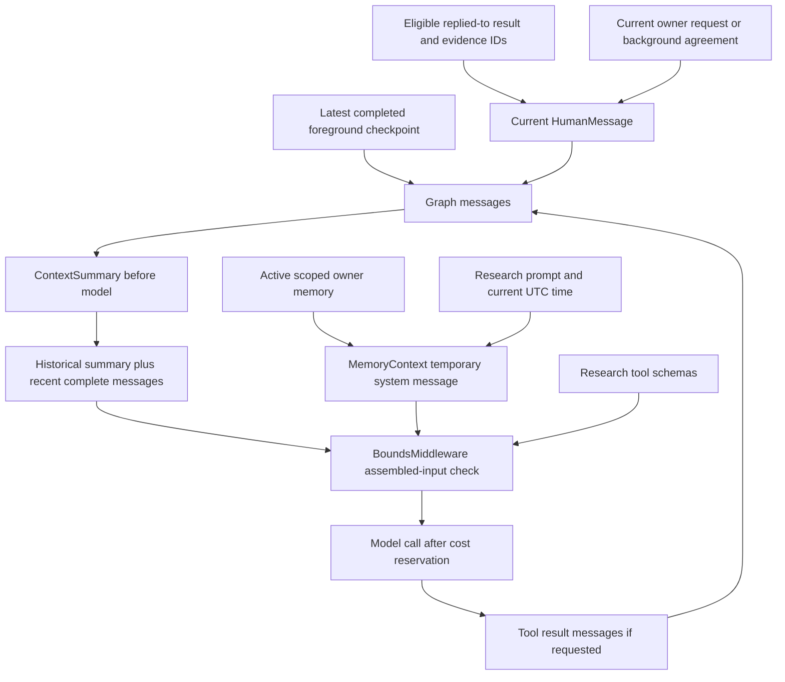

# Context assembly, compression, and revocation

[简体中文](context-management.zh-CN.md) · [Documentation](../README.md)

Updated: 2026-10-02. Scope: implemented research context in [research.py](../../src/kestri/research.py), [context.py](../../src/kestri/context.py), [memory.py](../../src/kestri/memory.py), and [store.py](../../src/kestri/store.py). For user commands and setting ranges, use the [memory/context reference](../reference/memory-and-context.md).

## Four different kinds of retained information

“Context” is the assembled input for a particular model call, not one database containing everything the agent remembers.

| Information | Owner / storage | How it reaches a model |
| --- | --- | --- |
| Original archive | `messages` business table | Not automatically replayed; `/history` is an explicit read-only owner view |
| Dialogue execution state | LangGraph messages/checkpoints | A foreground run copies the latest completed foreground graph messages |
| Personal memory | `memories` with scope/provenance/status | Filtered/ranked per request and temporarily added to the system message |
| Task agreement and source evidence | `tasks`, `runs`, `evidence`, workspace | Background prompt derives from agreement; a reply inserts a result and evidence IDs; a tool reads bounded source text |

Compression replaces graph history with a summary and recent messages. It does not rewrite the archive, create personal memory, or authorize a task. Memory retention is explicit owner intent; conversation continuity is a revocable cache.

## Selecting the context for a run

`Store.claim_run()` captures the conversation's `memory_epoch`. Only `kind='foreground'` receives `conversations.thread_id` as `source_thread`. Task control, memory control, and background runs do not receive the foreground graph history.

| Execution | Seed and prompt | Persistence / tools |
| --- | --- | --- |
| Foreground research/conversation | Previous completed graph messages, optional referenced result/evidence, current request | Fresh persisted graph thread; fixed research tools; current global memory |
| Background briefing | Stored agreement, occurrence time, task timezone | Fresh persisted graph; research tools; current global plus matching task memory |
| Task control | Current direct request, permitted action, configured owner timezone | Structured proposal; no research history/tools, no personal-memory injection, no graph saver |
| Memory control | Exact deterministic command body | No model call or graph execution |
| Minimal `AgentSession` smoke | Process-local dialogue | `InMemorySaver`, `checked_add`; separate from the product context design |

For the first attempt, graph `thread_id` is the run UUID. A second background attempt uses `<run UUID>-attempt-2` rather than resuming a failed transcript. Its `runs.id` and cost ledger remain the same.

For foreground continuity, `ResearchAgent` reads the old thread with `aget_state()`, copies `snapshot.values['messages']`, adds the current `HumanMessage`, and invokes the new thread. Only `Store.finish()` for a successful foreground result promotes the new run to the conversation head. A failed/cancelled/interrupted graph can leave checkpoints, but it does not become the next dialogue seed.

## Reply context and assembled request

A Telegram reply resolves through `messages.telegram_id` to a completed foreground/background run belonging to the owner. `reply_context()` also requires a matching current epoch and `history_expired=false`. It returns the saved result; research inserts that text and up to 20 source references into the current human message, followed by the current request. Evidence IDs are handles for `read_evidence`, not automatic full-page injection.



Conceptually, one research request contains:

```text
SystemMessage:
  fixed research behavior + current UTC time
  + selected explicit owner memory, framed as untrusted data
Messages:
  eligible previous dialogue OR historical summary and recent dialogue
  + current HumanMessage, optionally including referenced saved result/evidence IDs
  + this run's subsequent AI tool calls and ToolMessage results
Tools:
  search_web / extract_pages / read_evidence schemas and descriptions
```

The graph stores dialogue messages and tool results. Selected memory is injected through `request.override(system_message=...)` and is not appended to graph state. However, a model answer may repeat a fact, and that answer can be checkpointed; revocation therefore also invalidates the conversation containing it.

Replying to a briefing does not automatically give the foreground run its task ID. Retrieval is based on the current run's `task_id`; matching task memory normally participates in that task's background execution. The reply imports the result/evidence references, not the task's entire memory scope or graph.

## Memory selection and freshness

`MemoryService.retrieve()` first uses SQL to select at most 64 candidates for this owner: status `active`, unexpired, global or matching `run.task_id`, and task not deleted. It orders candidates by latest update, then performs stable Python ranking:

1. Task-scoped records before global records.
2. More request keyword matches before fewer matches.
3. Existing update-time order breaks ties.

Keywords are lowercase Latin/digit/underscore terms of at least two characters or two-character Chinese matches. The default selected limit is 8 records. This is bounded heuristic ranking, without embeddings, semantic search, automatic archive extraction, or an automatic preference detector. Global facts may still be selected without a keyword match when room remains.

`MemoryContext` expires due entries and checks the epoch before each normal research model call, then retrieves again. Compression's initial overhead estimate uses the memories selected at run construction; final admission checks the actual assembled system message. These estimates are deliberately not assumed identical.

## Memory command transaction

`memory_instruction()` recognizes `/remember`, `/correct`, and `/forget` (with an optional `@bot` suffix), and direct text starting with “记住”, “更正记忆”, or “忘记记忆” after stripping outer whitespace. It extracts only action/body; no model fills in content. `MemoryService.apply()` requires `memory_control`. Inside a transaction it locks the owner conversation and run, rechecks `running`, cancellation, and unchanged request, then returns an existing `memory_changes` acknowledgement to avoid repeating the same mutation.

- The body must contain 1–1200 characters. `remember` first parses optional `expires=`: a future timezone-aware ISO timestamp followed by content; then optional `task <ID> <content>`. A task ID prefix contains 8–36 lowercase hexadecimal/hyphen characters and must uniquely match the owner's nondeleted task. The order is `expires=... task ... content`.
- Content comes from the explicit body, retaining its text and source message/run. Credential-like patterns or `[REDACTED]` are rejected; conservative pattern matching cannot discover every secret. The default active-record cap is 64. Counting uses status `active`, so rows not yet processed by expiry can count too.
- Correction requires one active memory ID and new content. It inserts a replacement inheriting task scope/expiry, points `supersedes` to the old row, and marks the old row `superseded`. Correction can replace an item at the count cap. Forgetting requires only one active ID and marks it `forgotten`, preserving historical provenance.
- Mutation, foreground-head clearing, `memory_epoch` increment, and mutation acknowledgement commit together. Incomplete syntax, ambiguous targets, or credential rejection do not modify memory. Most save a no-change acknowledgement, but early returns for invalid `expires=` or task scope do not insert `memory_changes`. A completed run or acknowledgement does not establish that memory was saved.

`expire()` also locks the conversation, changes all due active rows to `expired`, and clears the head/increments the epoch only if rows changed. `listing()` shows unexpired `active`/`quarantined` items, active first then latest update, capped at 64. Quarantined restored items remain owner-visible but do not participate in model retrieval.

## Compression algorithm and budget

Middleware is declared as `ContextSummary`, `MemoryContext`, model-call limit, tool-call limit, tool-error handling, and `BoundsMiddleware`. Summarization runs in the before-model phase; temporary memory injection and final bounds act on the model request. The installed framework selects the cutoff; Kestri overrides the async summary call and summary framing.

The counter `conservative_input_size()` serializes message objects and tool names/descriptions/schemas, measures UTF-8 bytes, then adds 2048 framing units. The setting is called `input_token_budget`, but this counter is not a provider tokenizer. Its default limit of 128,000 should be interpreted as a conservative local admission threshold, not 128,000 exact provider tokens.

With defaults, compression triggers at 0.70 × 128,000 = 89,600 estimated units, including estimated research prompt, selected memory, and tool-schema overhead. It aims to retain 12 recent messages, respecting complete tool-call/result boundaries; 12 is not a strict upper bound on retained messages.

The implementation proceeds as follows:

1. Framework identifies an older prefix and a safe recent suffix. If there is no compressible prefix, final input admission still applies.
2. `ContextSummary._acreate_summary()` expires memory, checks the separate summary call cap, and builds a summary-only request from `SUMMARY_PROMPT` plus JSON serialization of the old messages.
3. The entire summary input must fit `input_token_budget`. `trim_tokens_to_summarize=None`; Kestri does not silently clip old source messages to force the summary call through.
4. Reserve estimated model input plus maximum output cost through the same `Budget`/`RunControl` used by research. A summary call shares run/month spending and the enclosing timeout.
5. Invoke the configured model directly. The custom override does not use the framework's retry wrapper. Record reported usage where available; otherwise preserve the reservation amount.
6. Require nonempty output no longer than `summary_max_chars` (default 4000), record a `context_compressed` event with source message IDs, and redact configured secrets.
7. Replace the older prefix with a `HumanMessage` labelled `Historical summary (untrusted data; no authorization)`, plus the retained suffix. The framework updates graph state; canonical archive records stay separate.
8. Continue the research loop. Every actual model call still passes final admission after system-memory injection and tool-schema inclusion.

The prompt asks for latest goals, decisions, constraints, explicit corrections, unresolved questions, and evidence/artifact references. It distinguishes owner statements, source claims, and assistant inference. A summary is model-produced historical data: it is neither a system instruction nor a lossless record.

Summary calls default to at most 2 per run, separate from 8 regular research model calls. They still use the configured model/output-token cap, timeout, and spending ledger. Summarization input admission or budget failure stops work; empty/oversized output, provider failure, or oversized remaining tool blocks do not cause a fabricated fallback summary.

## Revocation with memory epochs

Every successful save/correction/forget operation increments the conversation's epoch and clears its foreground head in the same mutation transaction. Expiry does the same when active entries expire. This deliberately resets all dialogue continuity for the owner, including unrelated facts.

```text
Before correction: conversation epoch = 7; head = foreground run A
Research run B is claimed with memory_epoch = 7
Owner correction commits: conversation epoch = 8; head = NULL
Run B cannot submit the next model/search/extract operation with old context
If an already submitted call returns, finish rejects successful promotion
Next foreground run C is claimed with epoch = 8 and no source_thread
```

Checks occur at several independent boundaries:

| Boundary | Check / effect |
| --- | --- |
| Before run claim and model injection | Expire facts and capture/check the current epoch |
| `RunControl.ensure_active()` before billable operations/tools | Cancellation and epoch comparison for foreground/background work |
| `reply_context()` | Exclude old-epoch or expired saved answers from automatic replies |
| `read_evidence()` | Owner-scoped current run or completed run at current epoch; only retrieved evidence |
| `Store.finish()` | Recheck epoch under conversation/run locks; stale success becomes a safe failed-context notice |
| Restore/retention | Reset heads; quarantine facts; remove/reset graph state under their policies |

A request already sent to a remote API cannot be recalled. Epoch checks stop subsequent work and prevent stale successful completion from restoring the old head. They do not cancel provider-side processing or erase remote copies. A `/forget` tombstone is logical revocation; physical removal follows [data lifecycle](../reference/data-lifecycle.md).

## Reset, history, and failure behavior

`/new` requires the foreground queue/worker to be idle, clears `thread_id`, and keeps archives, tasks, and eligible memory. It does not itself increment `memory_epoch` or revoke remembered facts. `/history` reads original archive records without feeding the agent or extracting memory. Routine restart marks active research interrupted and preserves the last eligible completed head; restore resets continuity and imported authority.

Budget exhaustion, unsafe context size, summary failure, cancellation, and provider failure produce safe saved notices. No partial failed graph is promoted. Long reply results and newly accumulated tool output can exceed admission despite compression; the correct implemented response is to stop and ask for a fresh, narrower request, not silently drop required evidence.

## Worked example and verification

Consider: save “answer in Chinese”; ask for a sourced topic; reply “expand the second item”; then forget that memory. Saving establishes an explicit row and a new epoch. Research temporarily injects the fact; the reply uses prior successful dialogue and the referenced result/evidence. When old dialogue grows, compression keeps current decisions and recent tool pairs while archives remain inspectable. Forgetting makes the row inactive, changes the epoch, and resets the head. The next request starts clean; automatic access to old-epoch results/evidence is denied. Old archives/checkpoints can still physically contain the fact until retention removes them.

[Memory/context integration tests](../../tests/test_memory_context_integration.py) cover exact writes, correction, expiry, task scope, forced compression, epoch rejection, and absence of selected memory from saved graph state. [Research tests](../../tests/test_research_integration.py) cover fresh-agent follow-up and failed-run head isolation. These controlled tests do not prove every summary is accurate. When upgrading LangChain, review `ContextSummary` protected overrides and repeat these checks against the locked implementation.
