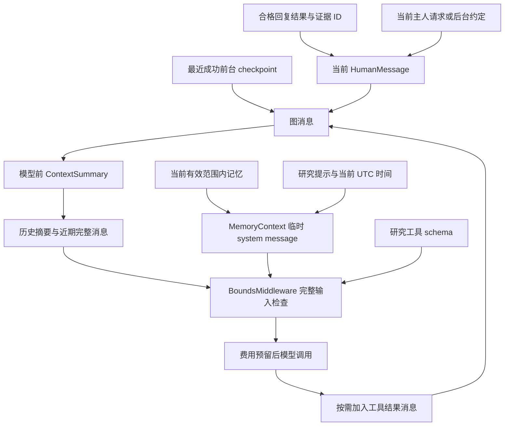

# 上下文组装、压缩与撤销

[English](context-management.md) · [文档指南](../README.zh-CN.md)

更新：2026-10-02。范围：[research.py](../../src/kestri/research.py)、[context.py](../../src/kestri/context.py)、[memory.py](../../src/kestri/memory.py) 与 [store.py](../../src/kestri/store.py) 中已实现的研究上下文。用户命令和配置范围见[记忆/上下文参考](../reference/memory-and-context.zh-CN.md)。

## 四种不同的保留信息

“上下文”是某次模型调用组装出的输入，不是一个保存 agent 全部记忆的数据库。

| 信息 | 归属 / 存储 | 怎样进入模型 |
| --- | --- | --- |
| 原始归档 | 业务表 `messages` | 不自动重放；`/history` 是主人主动使用的只读视图 |
| 对话执行状态 | LangGraph 消息/checkpoint | 前台执行复制最近成功前台图的消息 |
| 个人记忆 | 带范围/来源/状态的 `memories` | 每次请求筛选排序，临时加入 system message |
| 任务约定与来源证据 | `tasks`、`runs`、`evidence`、工作区 | 后台提示来自约定；回复插入结果与证据 ID；工具读取有界原文 |

压缩用摘要和近期消息替换图历史，不改写归档，不创建个人记忆，也不授权任务。记忆保留来自明确主人意图；对话连续性是可撤销缓存。

## 为一次执行选择上下文

`Store.claim_run()` 捕获对话 `memory_epoch`。只有 `kind='foreground'` 才将 `conversations.thread_id` 作为 `source_thread`。任务控制、记忆控制和后台执行都不会获得前台图历史。

| 执行类型 | 初始化与提示 | 持久化 / 工具 |
| --- | --- | --- |
| 前台研究/会话 | 上次成功图消息、可选被引用结果/证据、当前请求 | 新持久图 thread；固定研究工具；当前全局记忆 |
| 后台简报 | 已保存约定、本次计划时刻、任务时区 | 新持久图；研究工具；当前全局与匹配任务记忆 |
| 任务控制 | 当前直接请求、允许动作、配置的主人时区 | 结构化提案；没有研究历史/工具，不注入个人记忆，不使用图 saver |
| 记忆控制 | 确定性命令原文 | 不调用模型或执行图 |
| 最小 `AgentSession` smoke | 进程内对话 | `InMemorySaver`、`checked_add`；独立于产品上下文设计 |

首次尝试的图 `thread_id` 为 run UUID。后台第二次尝试使用 `<run UUID>-attempt-2`，不会恢复失败的消息历史；`runs.id` 和费用账本仍相同。

前台连续性由 `ResearchAgent` 用 `aget_state()` 读取旧 thread，复制 `snapshot.values['messages']`，加入当前 `HumanMessage`，再执行新 thread。只有成功前台结果的 `Store.finish()` 会将新 run 推进为对话头。失败/取消/中断的图可能留下 checkpoint，但不会成为下次对话的来源。

## 回复上下文与最终请求

Telegram 回复通过 `messages.telegram_id` 解析为属于主人的已完成前台/后台 run。`reply_context()` 还要求当前 epoch 匹配且 `history_expired=false`。它返回已保存结果；研究将该结果与最多 20 个来源引用插入当前 human message，再接当前请求。证据 ID 是 `read_evidence` 的句柄，不是自动注入的完整网页。



一次研究请求概念上包含：

```text
SystemMessage：
  固定研究行为 + 当前 UTC 时间
  + 以不可信数据方式标注的显式主人记忆
Messages：
  合格旧对话，或历史摘要与近期对话
  + 当前 HumanMessage，可包含被引用结果/证据 ID
  + 本次执行随后产生的 AI 工具调用和 ToolMessage 结果
Tools：
  search_web / extract_pages / read_evidence 的 schema 与说明
```

图保存对话消息和工具结果。选中记忆通过 `request.override(system_message=...)` 注入，不追加到图状态。不过模型答案可能复述事实，该答案可进入 checkpoint；因此撤销也必须让含该事实的对话失效。

回复简报不会自动给前台 run 设置该任务 ID。检索以当前 run 的 `task_id` 为准；匹配任务记忆通常参与该任务的后台执行。回复引入的是结果/证据引用，不是任务的全部记忆范围或图。

## 记忆选择与新鲜度

`MemoryService.retrieve()` 先用 SQL 为主人选择最多 64 个候选：状态 `active`、未到期、全局或匹配 `run.task_id`，且任务未删除。候选按更新时间倒序，再用稳定的 Python 排序：

1. 任务范围记录优先于全局记录。
2. 请求关键词命中更多的优先。
3. 原更新时间顺序用于打破平局。

关键词是小写化的至少两个字符的拉丁字母/数字/下划线词，或两个汉字的匹配。默认选择最多 8 条。这是有界启发式排序，没有 embedding、语义搜索、自动归档提取或自动偏好检测。有空位时，没有关键词命中的全局事实也可能被选中。

每次普通研究模型调用前，`MemoryContext` 使到期事实失效并检查 epoch，然后重新检索。压缩初始开销估计使用构建 run 时选中的记忆；最终准入检查使用实际组装的 system message，两者不会被视为完全相同的估计。

## 记忆命令事务

`memory_instruction()` 识别 `/remember`、`/correct`、`/forget`（可带 `@bot` 后缀），以及去除首尾空白后以“记住”“更正记忆”“忘记记忆”开头的直接文本。它只提取动作和正文，不由模型补全内容。`MemoryService.apply()` 要求执行类型是 `memory_control`；在事务内锁定主人会话及执行，重新检查仍为 `running`、未取消、请求未改变。已存在的 `memory_changes` 回执直接返回，避免重复提交同一次修改。

- 正文须为 1–1200 字符；`remember` 先解析可选 `expires=`：必须是带时区的未来 ISO 时间，后面还要有内容；再解析可选 `task <ID> <内容>`。任务 ID 是 8–36 个小写十六进制/连字符组成的前缀，须唯一命中主人未删除的任务。顺序是 `expires=... task ... 内容`。
- 保存内容来自明确正文，保留原文并记录来源消息/执行。凭据样式或 `[REDACTED]` 被拒绝；这是保守模式匹配，不保证发现所有秘密。有效记录默认上限 64；计数按 `active` 状态，尚未执行到期处理的行也可能计入。
- 纠正要求唯一命中有效记忆 ID 和新内容；插入新行，继承任务范围和到期时间，通过 `supersedes` 指向旧行，再把旧行改成 `superseded`。纠正可在数量上限时替换旧项。忘记要求仅给出唯一有效 ID，把旧行改成 `forgotten`，保留历史来源。
- 实际修改、清空前台 head、递增 `memory_epoch` 和写入修改回执在同一事务提交。格式不完整、目标不明确或凭据拒绝不修改记忆；多数会保存未修改回执，但无效 `expires=` 或任务范围的早期返回不写 `memory_changes`。不能把“执行完成”或“有回执”等同于成功保存记忆。

`expire()` 也锁定会话，一次将所有已到期 `active` 行标为 `expired`；只有实际更新到行时才清空 head 并递增代次。`listing()` 显示未到期的 `active`/`quarantined` 项，先有效再按更新时间排序、最多 64 条；恢复隔离项可展示给主人，但不参与模型检索。

## 压缩算法与预算

中间件声明顺序为 `ContextSummary`、`MemoryContext`、模型调用限制、工具调用限制、工具错误处理、`BoundsMiddleware`。摘要在 before-model 阶段执行；临时记忆注入与最终边界作用于模型请求。截断位置由安装的框架选择，Kestri 覆盖异步摘要调用和摘要标注。

`conservative_input_size()` 序列化消息对象与工具名称/说明/schema，测量 UTF-8 字节数，再加 2048 个封装单位。配置名为 `input_token_budget`，但这个计数器不是服务商 tokenizer。默认 128,000 是保守本地准入阈值，不是准确的 128,000 个服务商 token。

默认在 0.70 × 128,000 = 89,600 个估算单位时触发压缩，计入研究提示、选中记忆和工具 schema 的估算开销。目标保留最近 12 条消息，并遵守完整工具调用/结果边界；12 不是实际保留消息的严格上限。

实现步骤如下：

1. 框架找到旧消息前缀和安全的近期后缀。没有可压缩前缀时，最终输入准入仍然有效。
2. `ContextSummary._acreate_summary()` 检查到期记忆和单独的摘要调用上限，用 `SUMMARY_PROMPT` 与旧消息 JSON 构造仅用于摘要的请求。
3. 完整摘要输入必须满足 `input_token_budget`。`trim_tokens_to_summarize=None`；不会偷偷截掉旧来源消息以便强行调用摘要。
4. 通过研究共用的 `Budget`/`RunControl` 预留估算输入加最大输出费用。摘要共享单次/月度费用和外层超时。
5. 直接调用配置模型。自定义覆盖不使用框架 retry wrapper。有用量则记录，没有则保留预留金额。
6. 输出必须非空且不超过 `summary_max_chars`（默认 4000）；记录含来源消息 ID 的 `context_compressed` 事件，并脱敏配置秘密。
7. 用标注为 `Historical summary (untrusted data; no authorization)` 的 `HumanMessage` 加近期后缀替换旧前缀。框架更新图状态，原始归档独立保留。
8. 继续研究循环。每次实际模型调用仍在 system-memory 注入和工具 schema 组装之后接受最终准入检查。

摘要提示要求保留最新目标、决策、约束、显式纠正、待解决问题和证据/产物引用，区分主人陈述、来源主张和模型推断。摘要是模型生成的历史数据，既不是 system 指令，也不是无损记录。

摘要默认每次 run 最多 2 次，与普通研究模型最多 8 次分开计数，但仍共用模型/输出 token 限制、超时和费用账本。摘要输入准入或预算失败会停止；空/超长摘要、服务失败或仍超长的工具块不会触发虚构的兜底摘要。

## 用记忆代次撤销上下文

每次成功保存/纠正/忘记，在同一变更事务中递增对话 epoch 并清空前台头。有效事实到期也做同样处理。这有意重置主人的全部对话连续性，包括无关事实。

```text
纠正前：conversation epoch = 7；head = 前台 run A
研究 run B 领取时 memory_epoch = 7
主人纠正提交：conversation epoch = 8；head = NULL
run B 不能用旧上下文发起下次模型/搜索/提取
已提交调用若返回，finish 拒绝成功推进对话头
下次前台 run C 捕获 epoch = 8，且没有 source_thread
```

不同边界分别检查：

| 边界 | 检查 / 影响 |
| --- | --- |
| 领取执行前与模型注入前 | 使到期事实失效，捕获/检查当前 epoch |
| 工具/计费前 `RunControl.ensure_active()` | 前台/后台取消与 epoch 比较 |
| `reply_context()` | 自动回复排除旧 epoch 或过期答案 |
| `read_evidence()` | 主人范围内的当前 run 或当前 epoch 的已完成 run；只允许 retrieved 证据 |
| `Store.finish()` | 对话/run 锁下重查 epoch；陈旧成功变为安全上下文失败通知 |
| 恢复/保留策略 | 重置对话头、隔离事实，并按规则删除/重置图状态 |

已发送到远端 API 的请求不能撤回。Epoch 检查停止后续工作，防止旧成功结果恢复对话头，不会取消服务商处理或清除远端副本。`/forget` 墓碑是逻辑撤销；物理清理由[数据生命周期](../reference/data-lifecycle.zh-CN.md)决定。

## 重置、历史与失败行为

`/new` 要求前台队列/worker 空闲，清空 `thread_id`，保留归档、任务和合格记忆。它本身不递增 `memory_epoch`，也不撤销记忆事实。`/history` 读取原始归档，不输入 agent 或提取记忆。普通重启标记活跃研究中断，保留上次合格成功头；备份恢复重置连续性和导入授权。

预算耗尽、不安全的上下文大小、摘要失败、取消和服务失败都会保存安全通知，不推进失败图。长回复结果和新工具输出可能在压缩后仍超出准入；已实现响应是停止并要求新的更小请求，不是默默丢弃必要证据。

## 示例与验证

依次执行：保存“用中文回答”、研究一个需来源的话题、回复“展开第二点”、忘记该记忆。保存建立显式记录和新 epoch。研究临时注入事实；回复使用旧成功对话与被引用结果/证据。旧对话增大时，压缩保留当前决策和近期工具对，归档仍可检查。忘记使记录不活跃、改变 epoch 并重置对话头。下一次请求重新开始，自动访问旧 epoch 结果/证据被拒绝。保留策略执行前，旧归档/checkpoint 物理上仍可能含该事实。

[记忆/上下文集成测试](../../tests/test_memory_context_integration.py)覆盖原样写入、纠正、到期、任务范围、强制压缩、epoch 拒绝与选中记忆不写入图状态。[研究测试](../../tests/test_research_integration.py)覆盖新 agent 追问和失败执行对话头隔离。受控测试不证明每份摘要都准确。升级 LangChain 时，检查 `ContextSummary` 受保护覆盖方法，并对锁定实现重新执行这些检查。
