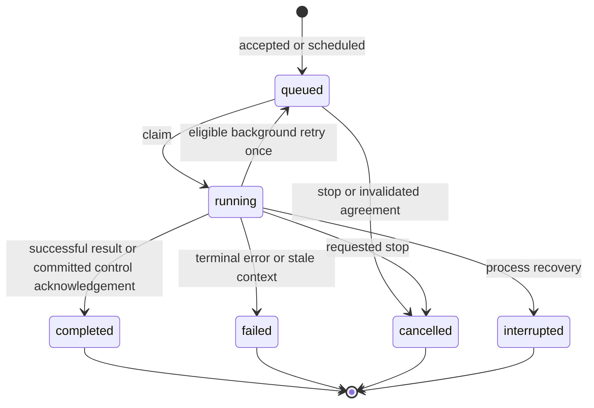
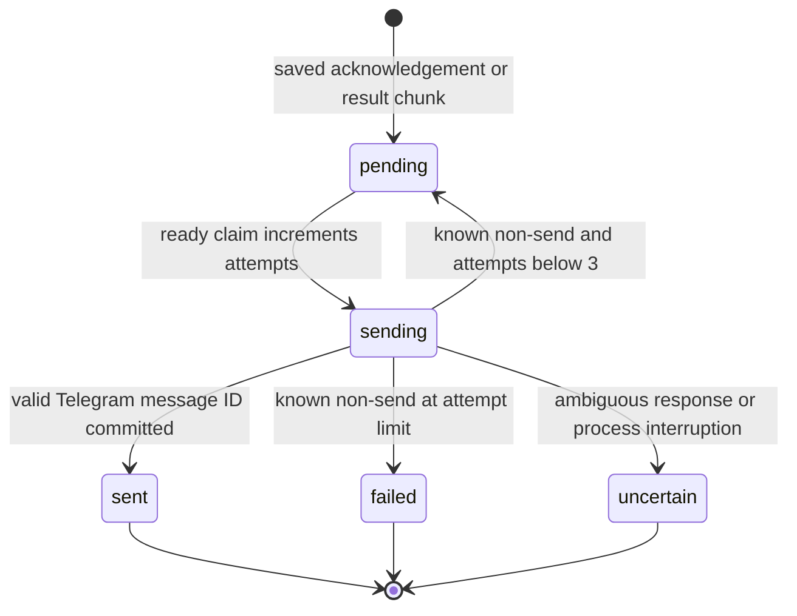

# Input acceptance, execution, delivery, and recovery

[简体中文](execution-and-delivery.zh-CN.md) · [Documentation](../README.md)

Updated: 2026-10-02. Sources: [application.py](../../src/kestri/application.py), [telegram.py](../../src/kestri/telegram.py), [store.py](../../src/kestri/store.py), and [research.py](../../src/kestri/research.py). [Architecture](architecture.md) supplies the module map; [database](../reference/database.md) supplies fields and locks.

## Telegram transport contract

`TelegramClient` builds a fixed Bot API base containing the configured token. `call()` uses bounded `post_json(..., allow_error_json=True)`, requires `ok` to be exactly true/false, validates an integer error code on rejection, and returns `result` on success. API 429 becomes `DeliveryProblem('RateLimited', uncertain=False, delay=retry_after)`; other explicit API rejections become `TelegramRejected_<code>`. Missing/invalid envelope fields are `ProviderFailure`, not successful delivery.

`identity()` requires a result dictionary with an integer bot ID. `configure_menu()` registers 14 commands scoped only to the owner chat, with default English and `zh` descriptions, then sets the commands menu button. The menu is UI guidance; typing and selecting commands use the same authorization path.

`poll()` requests only `message` updates, batch limit 20, default server wait 25 seconds, and optional offset. The application uses a separate HTTP client with timeout 40 seconds. Invalid list/update identities fail safely. There is no webhook receiver; startup refuses an existing webhook rather than deleting it.

`authorized_message()` requires a dictionary message, configured non-bot sender, private chat whose ID equals owner ID, string text, and integer message ID. Unsupported media/update types do not start work. The poller can advance past rejected messages without retaining their content. Forwarded authorized text can remain ordinary research, but cannot become task/memory authority.

## Command routing and durable acceptance

`command_for()` recognizes exact stop words after strip/lower; slash recognition starts at the beginning of the text, strips an optional bot-name suffix, and returns `unknown` for unsupported slash commands. It does not trim leading spaces before slash recognition. `Application.accept_update()` determines memory/task intent, makes those controlled requests model-independent or proposal-based as appropriate, and calls `Store.accept()`.

`Store.accept()` first redacts configured secrets, inserts the `inbox.update_id` deduplication record, creates/locks the conversation, then either creates a queued run or executes a status/control notice. The queue count includes all non-background queued/running kinds. At capacity it archives the request and enqueues a queue-full notice without creating a run. It stores inbound archive text and an outbox acknowledgement in the same transaction. A duplicate returns false without another archive/run/acknowledgement.

The poller advances offset only after handling commits. `advance_offset()` stores the maximum next offset rather than moving backward. If a crash follows acceptance but precedes cursor advancement, provider redelivery is safe through inbox deduplication. `wake_run`/`wake_delivery` accelerate workers; they are not the persistent queue.

| Direct command path | Implementation detail |
| --- | --- |
| `/start`, `/help` | Static capability/control/data-boundary text |
| `/status`, `/runs` | Latest 5 owner runs; evidence and usage-row counts, failed/uncertain outbox count, safe error type |
| `/usage` | UTC-month ledger totals and operation count; all reservation states count |
| `/tasks`, `/memory` | Deterministic stored views |
| `/history` | Latest 10 archive records in chronological display order; 500-character previews |
| `/history RECORD_ID [OFFSET]` | ASCII nonnegative digit arguments, at most 18 digits; owner-scoped 3000-character page and continuation |
| `/new` | Require no queued/running non-background work; clear head only, keep records/memory/tasks |
| `/task` without body | Static complete-request guidance |
| Unknown command | Static unsupported notice |

A complete save/correct/forget is queued as `memory_control`; interpreted task instructions are `task_control`. They share the serialized foreground worker with conversation. Existing menus and status requests do not give model tools permission to change those records.

## Execution state machine

`claim_run()` selects oldest ready queued work with `FOR UPDATE SKIP LOCKED`, records starting time and current epoch, and captures a foreground source head only for ordinary foreground research. A background claim also invalidates expired/changed agreements. Business status is separate from checkpoint existence and Telegram send state.

`work_once()` expires facts before claim, creates `RunControl` and an asyncio execution task, and records the active foreground/background pair. `ResearchAgent.run()` routes controls or creates the research graph. The graph persists intermediate state, but only business completion decides whether its conversation head is eligible.

`Store.finish()` locks conversation then run and operates only on a still-running record. Cancellation takes priority over ordinary results; an already-committed control acknowledgement then determines the authoritative control outcome. Completed research rechecks memory epoch; stale success becomes a safe failed-context result. Selected transient background failures may requeue once. Otherwise it records terminal result/error/time, marks unresolved spend unknown, promotes only a current-epoch completed foreground run, and writes result outbox rows together.

Background result text includes task/run ID and status, and is not a reply to a foreground Telegram message. Foreground results reply to the triggering message. Application source footers prefer `page_extract` over snippet rows for a URL, explicitly label failed/truncated material, and consume a bounded share of the reply. The model's wording cannot rewrite source retrieval status.

## Cancellation target and shutdown

`/stop UUID_PREFIX` requires an unambiguous 8–36 character lowercase UUID-form prefix. A reply-based stop resolves the referenced archived run. With no ID/reply, stop selects active non-background work; it does not automatically stop a background execution or an arbitrary queued request. Missing/ambiguous targets do not cancel unrelated work.

Acceptance persists `cancel_requested`; queued work immediately becomes cancelled, while running work remains running until finalization. The application sets the matching control event and cancels the active asyncio task. Before new model/tools, durable control checks stop further work. A remote operation already submitted can still complete or incur cost.

SIGTERM cancels the root application task. `work_once()` checks its cancellation state even if inner research handled cancellation, so the worker can propagate shutdown rather than wait forever. `serve()` runs six children in a TaskGroup; an unhandled child failure cancels the rest. Startup failure exits safely; model/pool/HTTP clients close in their enclosing cleanup paths. This is not a hot-reload or graceful guaranteed remote-request drain protocol.

## Outbox ordering and send state machine

`chunks()` splits result text into 3500-character parts, with a placeholder for empty text. Every part gets a UUID and monotonically generated sequence. `claim_delivery()` considers the earliest pending sequence; if its deadline is not reached, later pending rows wait. Claim commits `sending` and increments attempts before the remote operation. This preserves pending chunk order but can delay unrelated acknowledgements behind a retrying message.

`send()` uses plain text without `parse_mode`, disables link previews, removes the legacy keyboard, and uses `allow_sending_without_reply=true` when replying. Known connection establishment/pool failures are classified non-send. Other HTTP/provider-contract failures are uncertain. A success must contain an integer Telegram message ID; malformed success is uncertain. Explicit API rejection is known non-send; even apparently permanent rejection currently follows the bounded retry policy rather than a code-specific retry table.

Success commits outbox `sent`/Telegram ID and the outbound archive row together. Non-send with attempts below 3 becomes pending with delay clamped to 1–120 seconds; attempt 3 becomes failed. Uncertain is terminal for automatic sending. Delivery pauses 1.1 seconds after each attempt. Retrying saved content does not rerun research or alter the run's already-saved success status.

## Restart and restore are different

Ordinary startup recovery examines running runs. If a task/memory change result exists, it completes the run from that acknowledgement. Otherwise it finishes as interrupted with a safe notice and no graph replay. Existing queued work and pending saved sends remain available. Sending rows become uncertain, and reserved usage becomes unknown.

A successful remote send followed by local crash can leave no local confirmation; uncertainty avoids an automatic duplicate. There is no manual resend/reconciliation command. A completed result with failed delivery is still a completed run. Neither local unique keys nor graph checkpoints guarantee exactly-once remote delivery.

After restore, `prepare_restore()` handles `restore_quarantine.pending_updates`: poll with offset −1, advance to after the observed final pending update when present, clear the marker, and enqueue a recovery notice in a transaction. It precedes normal recovery. This discards pending updates at the restore boundary once, rather than interpreting old commands as current authority. Ordinary restart does not use that discard rule. Restore/quarantine internals are in [data maintenance](data-maintenance.md).

## Polling failures and observability

Polling waits 1–120 seconds on RateLimited, or 3 seconds on HTTP/provider failures. Other explicit Telegram rejections propagate rather than being retried forever; operational repair is required. Delivery failures use the separate classification above. A valid but unauthorized message is not a polling error.

`/runs` counts problematic saved delivery rows, not provider-side definitive receipt. `data status` checks database counts/maintenance, not loop liveness or model reachability. No complete prompt logger or distributed tracing dashboard exists. Inspect safe status, application exit, and dedicated evidence without exposing tokens embedded in Bot API URLs. [Research integration tests](../../tests/test_research_integration.py) cover acceptance, shutdown, head isolation, saved retries and uncertainty; [boundary tests](../../tests/test_boundaries.py) cover transport/menu/auth contracts; [task tests](../../tests/test_tasks_integration.py) cover background/control interactions.
