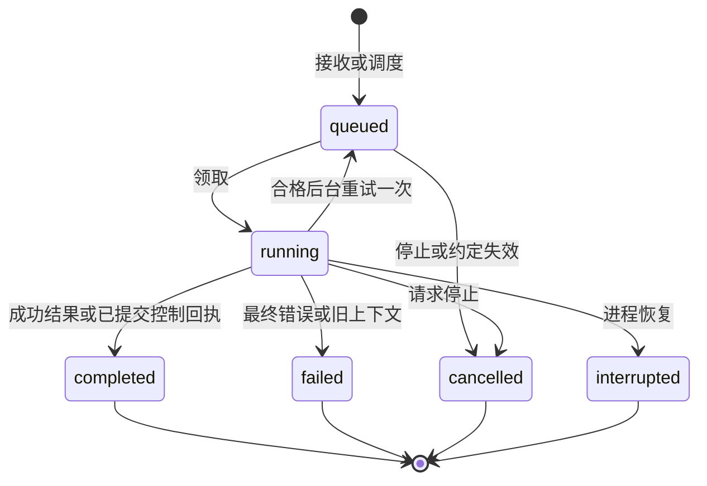
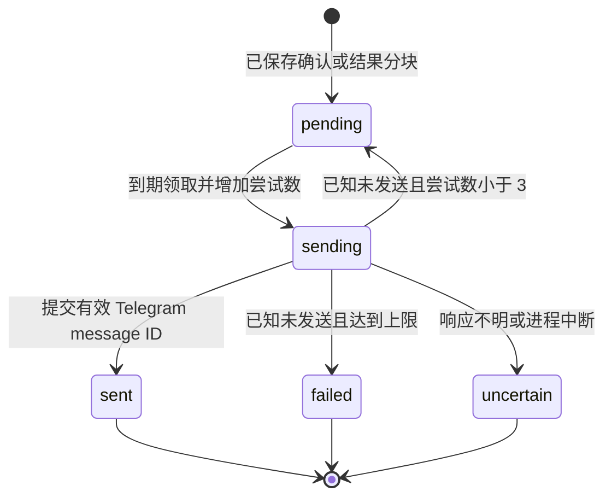

# 输入接收、执行、投递与恢复

[English](execution-and-delivery.md) · [文档指南](../README.zh-CN.md)

更新：2026-10-02。源码：[application.py](../../src/kestri/application.py)、[telegram.py](../../src/kestri/integrations/telegram.py)、[store.py](../../src/kestri/storage/store.py) 与 [research.py](../../src/kestri/agent/research.py)。模块地图见[架构](architecture.zh-CN.md)，字段和锁见[数据库](../reference/database.zh-CN.md)。

## Telegram 传输契约

`TelegramClient` 用配置 token 构造固定 Bot API base。`call()` 使用有界 `post_json(..., allow_error_json=True)`，要求 `ok` 准确为 true/false，拒绝时校验整数错误码，成功返回 `result`。API 429 转为 `DeliveryProblem('RateLimited', uncertain=False, delay=retry_after)`，其他明确拒绝为 `TelegramRejected_<code>`。缺失/非法 envelope 是 `ProviderFailure`，不是成功投递。

`identity()` 要求包含整数 bot ID 的字典。`configure_menu()` 只针对主人 chat 注册 14 条命令，含默认英文和 `zh` 描述，再设置 command menu button。菜单是界面指导；手输和菜单选择使用同一授权路径。

`poll()` 只取 `message` 更新，每批 20 条，默认服务端等待 25 秒，可提供 offset。应用使用独立 40 秒 timeout HTTP client。非法列表/update 标识安全失败。没有 webhook 接收器；启动拒绝已有 webhook，不删除它。

`authorized_message()` 要求 message 字典、配置的非 bot sender、ID 等于 owner ID 的私聊、字符串 text、整数 message ID。不支持媒体/更新不启动工作。轮询可推进越过拒绝消息而不保留内容。主人转发文本可用于普通研究，但不能成为任务/记忆授权。

## 命令路由与持久接收

`command_for()` 在 strip/lower 后识别准确 stop 用语；slash 必须从文本开头开始，可移除 bot-name 后缀，不支持 slash 返回 `unknown`。Slash 识别前不 trim 开头空格。`Application.accept_update()` 识别记忆/任务意图，将控制请求交给确定性执行或模型提案路径，再调用 `Store.accept()`。

`Store.accept()` 先脱敏配置秘密，插入 `inbox.update_id` 去重记录，创建/锁对话，再创建 queued run 或执行状态/控制通知。容量计入全部非后台 queued/running 类型。队列满仍归档请求并写 queue-full 通知，但不创建 run。同一事务写入输入归档和 outbox 确认。重复返回 false，不再创建归档/run/确认。

处理提交后轮询才推进 offset。`advance_offset()` 保存最大的下一 offset，不倒退。接收后、推进前崩溃，可通过 inbox 去重安全处理服务重发。`wake_run`/`wake_delivery` 加速 worker，不是持久队列。

| 直接命令路径 | 实现细节 |
| --- | --- |
| `/start`、`/help` | 静态能力/控制/数据边界说明 |
| `/status`、`/runs` | 最近 5 条主人 run；证据/用量行数、失败/不确定 outbox 数、安全错误类型 |
| `/usage` | UTC 月账本金额与操作数，计入所有预留状态 |
| `/tasks`、`/memory` | 确定性存储视图 |
| `/history` | 最近 10 条归档按时间顺序展示，每项预览 500 字符 |
| `/history RECORD_ID [OFFSET]` | 非负 ASCII 数字参数，最多 18 位；主人范围内 3000 字符分页与继续指令 |
| `/new` | 要求没有非后台 queued/running；只清空对话头，保留记录/记忆/任务 |
| 无正文 `/task` | 静态完整请求指导 |
| 未知命令 | 静态不支持通知 |

完整保存/纠正/忘记作为 `memory_control` 排队，需要解释的任务指令为 `task_control`，与会话共享串行前台 worker。菜单和状态请求不授予模型变更记录的工具权限。

## 执行状态机

`claim_run()` 用 `FOR UPDATE SKIP LOCKED` 选择最早可运行 queued 工作，记录开始时间/epoch，只有普通前台研究捕获前台来源头。后台领取还拒绝过期/变更约定。业务状态、checkpoint 是否存在、Telegram 发送状态互相独立。

`work_once()` 领取前使到期事实失效，创建 `RunControl` 和 asyncio 执行 task，记录活跃前台/后台组合。`ResearchAgent.run()` 路由控制或创建研究图。图保存中间状态，业务完成决定对话头是否可用。

`Store.finish()` 先锁对话再锁 run，只处理仍 running 的记录。取消优先于普通结果；随后已提交控制回执决定权威控制结果。成功研究重查 memory epoch；陈旧成功变成安全上下文失败。指定后台暂时性错误可重新排队一次。其他情况一起保存最终结果/错误/时间、未知费用、仅成功当前 epoch 前台推进头、结果 outbox 分块。

后台结果包含 task/run ID 和状态，不回复前台 Telegram 消息；前台结果回复触发消息。来源页脚对同 URL 优先 `page_extract` 而非 snippet，明确失败/截断，占用回复的一部分有界额度。模型措辞不能改变获取状态。

## 取消目标与关闭

`/stop UUID_PREFIX` 要求 8–36 字符小写 UUID 形式且唯一。回复式 stop 解析被引用归档 run。无 ID/回复时选择运行中的非后台工作，不自动停止后台或任意排队请求。缺失/模糊目标不取消其他工作。

接收时保存 `cancel_requested`；排队直接变 cancelled，运行中保持 running 等待最终完成。应用设置对应控制事件并取消活跃 asyncio task。模型/工具前持久检查阻止后续工作；已提交远端请求仍可能完成/计费。

SIGTERM 取消根应用 task。即使内部研究处理了取消，`work_once()` 仍检查自身取消状态并传播关闭，避免继续永久等待。`serve()` 的六个子任务由 TaskGroup 管理，未处理异常取消其他循环。启动失败安全退出；model/pool/HTTP client 在对应清理路径关闭。这不是热重载或保证排空远端请求的协议。

## Outbox 顺序与发送状态机

`chunks()` 按 3500 字符切结果，空内容有占位符。每块有 UUID 和递增 sequence。`claim_delivery()` 考虑最早 pending sequence，尚未到期则后面等待。远端操作前先提交 sending 并递增 attempts。保证 pending 分块顺序，但重试消息可延迟无关确认。

`send()` 发送纯文本，不设置 `parse_mode`，关闭链接预览、移除旧 keyboard；回复使用 `allow_sending_without_reply=true`。明确连接建立/pool 失败归为未发送；其他 HTTP/服务契约失败归不确定。成功必须有整数 Telegram message ID，非法成功响应归 uncertain。明确 API 拒绝归已知未发送；当前即使看似永久拒绝也走有界重试，没有按错误码细分重试表。

成功一起提交 outbox sent/Telegram ID 和输出归档。已知未发送且 attempts 小于 3 时回 pending，delay 限制 1–120 秒；第 3 次变 failed。Uncertain 自动发送终止。每次尝试后暂停 1.1 秒。重试已存正文不重跑研究，也不改变已保存 run 成功状态。

## 重启与恢复导入不同

普通启动恢复扫描 running run。有任务/记忆回执则从回执完成，否则保存 interrupted 通知，不重放图。既有 queued 工作和 pending 投递保留。Sending 变 uncertain，reserved 用量变 unknown。

远端已发送、本地确认前崩溃，可能没有本地确认；uncertain 避免自动重复。没有手工重发/对账命令。结果 completed、发送 failed 可以同时成立。本地唯一键和图 checkpoint 都不保证远端恰好一次。

备份恢复后，`prepare_restore()` 处理 `restore_quarantine.pending_updates`：用 offset −1 轮询，有最后更新时推进到其后，在事务中清标记并写恢复通知，先于普通 recover。这在恢复边界一次性丢弃 pending 更新，避免将旧命令当当前授权；普通重启不使用此规则。内部细节见[数据维护](data-maintenance.zh-CN.md)。

## 轮询失败与观察

Polling 对 RateLimited 等待 1–120 秒，对 HTTP/服务错误等待 3 秒；其他明确 Telegram 拒绝传播，不永久重试，需要维护修复。投递使用上方独立分类。合法但未授权消息不是轮询错误。

`/runs` 统计有问题的投递行，不证明服务端确定收件。`data status` 检查数据库数量/维护，不证明循环活跃或模型可达。没有完整 prompt logger 或分布式 trace dashboard。查看安全状态、退出与专用证据时，不暴露 Bot API URL 中的 token。[研究集成测试](../../tests/agent/test_research_integration.py)覆盖接收、关闭、对话头隔离、已存重试和不确定；[边界测试](../../tests/integrations/test_boundaries.py)覆盖传输/菜单/授权；[任务测试](../../tests/tasks/test_tasks_integration.py)覆盖前后台/控制交互。
