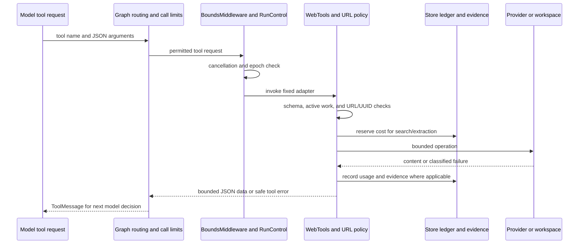

# Tool interfaces and execution boundaries

[简体中文](tools.zh-CN.md) · [Documentation](../README.md)

Updated: 2026-10-02. Scope: implemented tool schemas, public-information adapters, evidence files, and failure/accounting behavior. Sources: [web.py](../../src/kestri/web.py), [url_policy.py](../../src/kestri/url_policy.py), [workspace.py](../../src/kestri/workspace.py), [research.py](../../src/kestri/research.py), and [budget.py](../../src/kestri/budget.py).

## Capability sets and authority

A model can request only tools supplied to its graph. The tool descriptions guide behavior; schemas and application code enforce the actual boundary.

| Agent or operation | Capability set | Authority |
| --- | --- | --- |
| Product research graph | `search_web`, `extract_pages`, `read_evidence` | Public sources and permitted application-managed evidence |
| Minimal smoke graph | `checked_add` | Bounded integer addition; not supplied to product research |
| Task planning graph | `tools=[]` plus structured-output `TaskPlan` schema | Produce a proposal; `TaskService` alone validates/commits changes |
| Memory commands | No model tools | Deterministic owner command through `MemoryService` |
| Operator data commands | Local CLI, not agent tools | Backup/restore/export/cleanup through `DataService` |

There is no model tool for arbitrary file paths, shell commands, credentials, account operations, task creation, memory writes, or downloading/installing new tools. `ToolStrategy(TaskPlan)` can serialize a proposal as a tool-style model response, but that response is not a direct mutation capability.

`WebTools` captures store, workspace, budget/run control, owner chat ID, HTTP client, and URL policy at construction. The model cannot override these through tool parameters. Provider credentials belong to the HTTP client's headers. Returned pages, snippets, old results, and tool errors are data; they do not widen the capability set.

## Schemas and limits

The three web schemas use Pydantic `extra='forbid'` and strict validation. Unknown fields and incompatible types are rejected before the adapter executes. Limits are not instructions the model may negotiate.

| Tool | Input schema | Output and side effects |
| --- | --- | --- |
| `search_web` | `SearchInput`: `query` string, 1–500 characters; `topic` is `general` or `news`, default `general` | JSON snippets and source handles; cost reservation, provider request, evidence metadata/text |
| `extract_pages` | `ExtractInput`: `urls` list of 1–3 strings | JSON page excerpts or explicit failed records; URL checks, cost reservation, provider request, evidence metadata/text |
| `read_evidence` | `EvidenceInput`: `evidence_id` string, UUID checked by implementation | JSON retained content and truncation status; scoped database/file read, no search fee |
| `checked_add` | `AddInput`: strict integers `left`, `right`, each between −1,000,000 and 1,000,000; unknown fields forbidden | String sum; total must also be in range; no external/file side effects |

Default web tool output is at most 12,000 characters. Each evidence item retains at most 64,000 characters. Search model excerpts are at most 900 characters; extraction excerpts at most 2200; `read_evidence` reserves 1500 characters of its output allowance for metadata. The final JSON-size check can still reject an oversized result instead of returning broken JSON. Full request admission also counts tool descriptions and schemas.

## Search adapter

`search_web` checks the active run, redacts configured secrets from the query, and reserves one configured search-credit estimate. It posts to the fixed `https://api.tavily.com/search` endpoint with basic depth, at most five results, requested topic, usage enabled, and provider answer/raw-content/automatic-parameter generation disabled.

For at most five returned items it rechecks active work, validates each URL, records rejected URLs without returning their source content, and retains valid snippets as `kind='search_snippet'`. Output includes `trust`, `results`, `rejected_sources`, and a limitation that snippets are not full-page reads. A search is discovery, not proof that a page was extracted.

Provider-reported credit usage is recorded in reservation metadata. The current code does not compute a new dollar amount from those reported credits; it retains the configured reservation estimate. These local configured rates are not a verified current Tavily price list.

## Extraction adapter

`extract_pages` validates all input URLs and removes exact normalized duplicates before reserving cost. It posts to fixed `https://api.tavily.com/extract` with basic extraction, text format, a ten-second provider extraction timeout, images disabled, and usage enabled. The HTTP client also enforces the configured request timeout.

Returned items are matched by the exact requested normalized URL. Before retaining each result, the policy validates its requested URL again. An unrequested provider URL is not adopted as an authorized redirect. Missing or empty content becomes `status='failed'`, with `failure='ExtractionFailed'`; it does not create a successful text file. Retained pages use `kind='page_extract'`.

This matching is intentionally conservative and can classify a provider-normalized/redirected page as failed. It does not prove that the remote provider itself refused private redirects or pinned the same DNS addresses checked locally.

## Evidence contract and scoped reading

`WebTools.evidence()` generates a UUID, redacts text, retains up to 64,000 characters, writes successful text to the workspace, then inserts metadata. Its model-facing record has the following shape; values below illustrate one successful page:

```json
{
  "evidence_id": "11111111-1111-4111-8111-111111111111",
  "url": "https://example.com/article",
  "title": "",
  "kind": "page_extract",
  "status": "retrieved",
  "retained_truncated": false,
  "excerpt": "A bounded excerpt from the page...",
  "excerpt_truncated": true,
  "retrieved_at": "2026-10-02T00:00:00+00:00"
}
```

`retained_truncated` means the saved material exceeded retention size. `excerpt_truncated` means the model saw only part of the retained material. They are independent. Source metadata is not a guarantee of factual correctness or instruction trust. Titles are bounded to 300 characters; URLs, status, and truncation survive into the application-generated answer footer, which distinguishes snippet-only, failed extraction, and extracted excerpts.

`read_evidence` requires a valid UUID and queries evidence joined to runs. The owner must match. Allowed sources are the current run or a completed run at the owner's current memory epoch; there is no arbitrary host path or another owner's access. It does not require the evidence to have been listed in the current reply. Only `retrieved` records can be read, so failed/expired metadata cannot masquerade as text.

`Workspace` builds paths from validated run/evidence UUIDs: `<workspace>/<run UUID>/<evidence UUID>.txt`. It opens directory handles with `O_DIRECTORY`/`O_NOFOLLOW`, uses relative file operations, rejects symlinks, creates directories with mode 0700 and files with mode 0600, and writes exclusively with `O_EXCL`. Filesystem policy is enforced in code, not by the model's path choices. Reading is bounded, and reports clipping.

File write and database insert are separate operations; a failed metadata commit can leave an orphan. Retention first revokes evidence in the database, then unlinks it; unsuccessful deletion leaves `cleanup_pending` metadata for retry. See [database](../reference/database.md) and [data lifecycle](../reference/data-lifecycle.md).

## URL and network policy

`PublicURLPolicy.validate()` accepts only bounded, parseable public HTTP(S) targets and returns a URL without its fragment.

| Check | Rejection behavior |
| --- | --- |
| URL length, control/whitespace characters, backslash | Reject over 2048 characters, characters below ASCII 33, or backslash |
| Scheme, hostname, credentials, port | Require `http`/`https`, hostname, no URL username/password, port 80 or 443 |
| Local host suffixes | Reject localhost/local/internal/LAN forms recognized by the policy |
| Credential-like query keys | Reject `token`, `api_key`, `apikey`, `password`, `secret`, `access_token` |
| Literal IP or resolved addresses | Require at least one address; every address must be global; reject IPv4-mapped IPv6 |
| DNS failures | Deny unresolved/nonpublic target; do not treat resolution failure as permission |

System mode uses bounded `getaddrinfo`; opt-in Cloudflare mode queries A and AAAA over a dedicated credential-free HTTP client, bounds DNS response size, and does not fall back to system resolution on failure. DNS checks do not pin the remote provider's eventual fetch address. This is application target validation, not a browser sandbox or a guarantee against every provider-side redirect/rebinding scenario.

Kestri sends search/extraction only to fixed Tavily endpoints, not directly to arbitrary page URLs. `post_json()` streams at most 2,000,000 response bytes by default and requires a JSON object; malformed, oversized, or inappropriate-status responses produce safe error classifications. HTTP clients disable automatic redirects. Trusted application HTTPS endpoints and untrusted source URLs are different categories.

## Execution, cost, and failure path



Tool execution is limited by `ToolCallLimitMiddleware` (default 8) and the enclosing 120-second run timeout. `BoundsMiddleware` checks activity and records selected rejected/failed tool events. Web operations also check activity at their own boundaries. Read-only evidence access still needs cancellation/epoch checks even though it has no search fee.

Before search/extraction, `Budget.reserve()` uses a transaction-protected micro-USD ledger to reject overspending. On a successful response, adapter usage is settled; if a submitted request fails before known settlement, the reservation is later classified `unknown`, not refunded on assumption. Provider work may still bill after cancellation.

`ToolErrorMiddleware` returns safe data for known `PolicyDenied`, `ProviderFailure`, `ValueError`, or HTTP errors: the operation failed and success is not established. This permits a bounded follow-up correction, such as choosing a public URL. Cancellation, spending exhaustion, context limits, and unexpected failures are not converted into fake successful tool results; they stop or fail the run through research handling. Normal model calls are also separately bounded and reserved. Full provider error bodies and credentials are not returned to the model/user.

## Worked source flow

For “research a public topic,” the model may call `search_web` to discover candidates, `extract_pages` for selected URLs, and `read_evidence` to inspect retained text beyond an excerpt. Each call counts toward the same run tool cap. A failed page remains visibly failed even if another source succeeds. Research builds a source-status footer from saved rows; a model claiming a failed extraction succeeded does not change that stored status.

A later owner reply can receive evidence IDs from the earlier completed result and read them again while epoch/retention allow. The application retrieves saved evidence; it does not have to rerun the original search. After memory revocation or evidence expiry, automatic historical access is denied even if a model remembers the old UUID.

## Adding or changing a tool

An extension should specify the operation's inputs, scope, side effects, cost, output contract, and failure/recovery behavior before registration:

1. Add a narrow Pydantic schema with unknown-field rejection and size/type limits.
2. Keep owner/run identity, secrets, fixed clients, and workspace policy in application-injected dependencies.
3. Validate targets and check `RunControl` before external or local side effects; reserve billable work first.
4. Return bounded structured data with provenance and failure/truncation states; do not grant authority through retrieved text.
5. Persist required audit/evidence state, and identify gaps between file, database, and remote commits.
6. Register only in the graph that needs the capability. A write capability needs a separate authorization and recovery design, not only a descriptive prompt.
7. Add behavioral tests for denial, cancellation, limits, cost uncertainty, and retained results; update both language versions and schema/backup rules where needed.

[Boundary tests](../../tests/test_boundaries.py) cover private targets, symlinks, bounded HTTP, and transport uncertainty. [Research integration tests](../../tests/test_research_integration.py) cover source attacks, failed/truncated evidence, budgeting, and cancellation with the real graph. [Tool tests](../../tests/test_tools.py) cover addition validation; [runtime tests](../../tests/test_runtime.py) cover actual SDK serialization and tool-error handling. No test description here asserts live provider behavior beyond the separately recorded validation evidence.
