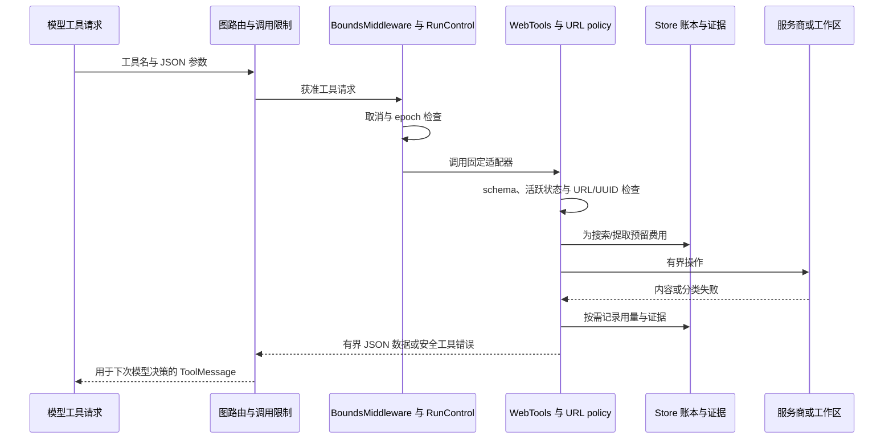

# 工具接口与执行边界

[English](tools.md) · [文档指南](../README.zh-CN.md)

更新：2026-10-02。范围：已实现的工具 schema、公共信息适配器、证据文件和失败/计费行为。源码：[web.py](../../src/kestri/integrations/web.py)、[url_policy.py](../../src/kestri/integrations/url_policy.py)、[workspace.py](../../src/kestri/storage/workspace.py)、[research.py](../../src/kestri/agent/research.py) 与 [budget.py](../../src/kestri/agent/budget.py)。

## 能力集合与授权

模型只能请求其图中注册的工具。工具说明指导行为；schema 与应用代码实施实际边界。

| Agent 或操作 | 能力集合 | 权限 |
| --- | --- | --- |
| 产品研究图 | `search_web`、`extract_pages`、`read_evidence` | 公共来源与允许的应用管理证据 |
| 最小 smoke 图 | `checked_add` | 有界整数加法；产品研究不提供它 |
| 任务规划图 | `tools=[]` 加结构化输出 `TaskPlan` schema | 生成提案；只有 `TaskService` 校验/提交变化 |
| 记忆命令 | 无模型工具 | 经 `MemoryService` 执行确定性主人命令 |
| 操作员数据命令 | 本地 CLI，不是 agent 工具 | 经 `DataService` 备份/恢复/导出/清理 |

没有让模型任意访问文件路径、shell、凭据、账户操作、创建任务、写记忆或下载/安装新工具的接口。`ToolStrategy(TaskPlan)` 可将提案序列化为工具式模型响应，但它不是直接变更能力。

`WebTools` 构造时捕获 store、workspace、budget/run control、主人 chat ID、HTTP client 与 URL policy。模型不能通过工具参数替换这些依赖。服务商凭据留在 HTTP client header。页面、搜索摘要、旧结果和工具错误都是数据，不会扩大能力集合。

## Schema 与限制

三个 web schema 使用 Pydantic `extra='forbid'` 和严格校验。未知字段、不兼容类型在适配器执行前拒绝。限制不是模型可以协商的提示。

| 工具 | 输入 schema | 输出与副作用 |
| --- | --- | --- |
| `search_web` | `SearchInput`：`query` 字符串，1–500 字符；`topic` 为 `general` 或 `news`，默认 `general` | JSON 摘要与来源句柄；预留费用、请求服务、保存证据元数据/正文 |
| `extract_pages` | `ExtractInput`：`urls` 为 1–3 个字符串的列表 | JSON 网页节选或明确失败记录；URL 校验、费用预留、服务请求、证据元数据/正文 |
| `read_evidence` | `EvidenceInput`：`evidence_id` 字符串，执行时校验 UUID | JSON 保留正文与截断状态；范围限定的数据库/文件读取，不收搜索费用 |
| `checked_add` | `AddInput`：严格整数 `left`、`right`，各在 −1,000,000 到 1,000,000；拒绝额外字段 | 字符串形式的和；总和也须在范围内；无外部/文件副作用 |

默认 web 工具输出最多 12,000 字符，每份证据最多保留 64,000 字符。搜索给模型的节选最多 900 字符，网页提取最多 2200；`read_evidence` 从输出额度中留出 1500 字符用于元数据。最终 JSON 大小检查仍可能拒绝超长结果，不返回损坏 JSON。完整请求准入还计算工具说明与 schema。

## 搜索适配器

`search_web` 检查 run 活跃状态，从 query 脱敏配置秘密，预留一份配置的 search-credit 估算。它向固定 `https://api.tavily.com/search` 发请求：basic depth、最多五条结果、请求指定 topic、开启 usage，关闭服务商 answer/raw-content/自动参数生成。

对最多五条返回结果再次检查活跃状态，校验 URL，记录被拒绝 URL 且不返回其来源内容，将有效搜索摘要保存为 `kind='search_snippet'`。输出包含 `trust`、`results`、`rejected_sources`，并声明摘要不是完整网页读取。搜索是发现候选，不是网页提取成功证明。

服务商报告的 credit 用量写入预留元数据。当前实现不会据此重新计算美元金额，而是保留配置的预留估算。这些本地费率不代表已核实的当前 Tavily 价目表。

## 网页提取适配器

`extract_pages` 先校验全部输入 URL，对准确规范化后的重复项去重，再预留费用。请求固定 `https://api.tavily.com/extract`：basic extraction、text 格式、服务端提取超时十秒、关闭图片、开启 usage。HTTP client 还实施配置的 request timeout。

返回结果按准确的请求规范化 URL 匹配。保存每项前再次校验对应请求 URL；服务返回的非请求 URL 不被视为获准重定向。缺失或空正文记为 `status='failed'`、`failure='ExtractionFailed'`，不创建成功正文文件。保留网页使用 `kind='page_extract'`。

这种匹配有意保守，可能把服务商规范化/重定向页面判为失败。它不证明远端服务自身拒绝了私网重定向，或固定使用本地检查过的 DNS 地址。

## 证据契约与限定读取

`WebTools.evidence()` 生成 UUID，脱敏文本，保留最多 64,000 字符，先写成功正文，再插入元数据。给模型的记录结构如下；示例表示一项成功网页：

```json
{
  "evidence_id": "11111111-1111-4111-8111-111111111111",
  "url": "https://example.com/article",
  "title": "",
  "kind": "page_extract",
  "status": "retrieved",
  "retained_truncated": false,
  "excerpt": "A bounded excerpt from the page...",
  "excerpt_truncated": true,
  "retrieved_at": "2026-10-02T00:00:00+00:00"
}
```

`retained_truncated` 表示保存材料超过保留上限；`excerpt_truncated` 表示模型只看到保存材料的一部分，两者独立。来源元数据不保证事实正确或指令可信。标题最多 300 字符；URL、状态和截断信息用于应用生成的回答页脚，区分仅搜索摘要、提取失败和已提取节选。

`read_evidence` 要求有效 UUID，查询 evidence 与 runs 的连接。主人必须匹配；允许当前 run 或主人当前 memory epoch 下的已完成 run，没有任意主机路径或其他主人访问。它不要求证据此前已列在当前回复中。只有 `retrieved` 可读取，失败/过期元数据不能伪装成正文。

`Workspace` 从校验过的 run/evidence UUID 生成 `<workspace>/<run UUID>/<evidence UUID>.txt`。目录句柄用 `O_DIRECTORY`/`O_NOFOLLOW` 打开，通过相对文件操作访问，拒绝符号链接；目录模式 0700，文件 0600，写入用 `O_EXCL` 独占创建。文件策略由代码实施，不依赖模型选路径。读取有界并报告 clipping。

文件写入和数据库插入分开，元数据提交失败可留下孤立文件。保留清理先在数据库撤销证据，再删除文件；失败保留 `cleanup_pending` 以便重试。见[数据库](../reference/database.zh-CN.md)和[数据生命周期](../reference/data-lifecycle.zh-CN.md)。

## URL 与网络策略

`PublicURLPolicy.validate()` 只接受有界、可解析的公共 HTTP(S) 目标，返回去掉 fragment 的 URL。

| 检查 | 拒绝行为 |
| --- | --- |
| 长度、控制/空白字符、反斜杠 | 超过 2048 字符、ASCII 33 以下字符或反斜杠均拒绝 |
| Scheme、hostname、凭据、端口 | 要求 `http`/`https`、hostname、无 URL 用户名/密码、端口 80 或 443 |
| 本地主机后缀 | 拒绝策略识别的 localhost/local/internal/LAN 形式 |
| 类凭据 query key | 拒绝 `token`、`api_key`、`apikey`、`password`、`secret`、`access_token` |
| 字面 IP 或解析地址 | 至少一个地址；全部必须为 global；拒绝 IPv4-mapped IPv6 |
| DNS 失败 | 拒绝无法解析/非公共目标；解析失败不是授权 |

System 模式使用有界 `getaddrinfo`；可选 Cloudflare 模式通过专用、无服务凭据的 HTTP client 查询 A 和 AAAA，限制 DNS 响应大小，失败不回退系统解析。DNS 校验不会固定远端服务最终抓取地址。这是应用目标校验，不是浏览器沙箱，也不保证阻止所有服务商侧重定向/rebinding 情况。

Kestri 只向固定 Tavily 端点发送搜索/提取，不直接请求任意网页 URL。`post_json()` 默认流式读取最多 2,000,000 字节且要求 JSON object；错误格式、超长或不适当 HTTP 状态转换为安全错误分类。HTTP client 禁止自动重定向。可信应用 HTTPS 端点和不可信来源 URL 属于不同类别。

## 执行、费用与失败路径



工具受 `ToolCallLimitMiddleware`（默认 8 次）和外层 120 秒执行超时限制。`BoundsMiddleware` 检查活跃状态并记录部分拒绝/失败事件。Web 操作也在自身边界重查。只读证据访问虽无搜索费，仍要检查取消和 epoch。

搜索/提取前，`Budget.reserve()` 用事务保护的微美元账本拒绝超额费用。成功响应后结算适配器用量；若已提交请求在明确结算前失败，预留稍后归为 `unknown`，不会假定未计费而退款。取消后服务商仍可能计费。

`ToolErrorMiddleware` 为已知 `PolicyDenied`、`ProviderFailure`、`ValueError` 或 HTTP 错误返回安全数据：操作失败，未证明成功。这样允许有界纠正，例如改选公共 URL。取消、预算耗尽、上下文限制和未知失败不会转换成虚假的成功工具结果，而是由研究处理停止或判定失败。普通模型调用也单独限次和预留费用。完整服务商错误正文和凭据不返回模型/用户。

## 来源处理示例

对于“研究一个公共话题”，模型可用 `search_web` 发现候选，`extract_pages` 提取选中 URL，`read_evidence` 检查节选之外的保留正文。每次调用都计入同一 run 工具上限。其他来源成功不会掩盖某页面失败。研究从已保存行生成来源状态页脚；模型宣称失败提取成功，不会改变存储状态。

之后主人回复可拿到旧成功结果的证据 ID，在 epoch/保留规则允许时重读。应用读取已保存证据，不必重跑原搜索。记忆撤销或证据到期后，即使模型记得旧 UUID，自动访问也被拒绝。

## 添加或修改工具

扩展前应先定义输入、范围、副作用、费用、输出契约和失败/恢复行为，再注册：

1. 添加窄范围 Pydantic schema，拒绝未知字段，限制大小和类型。
2. 主人/run 身份、秘密、固定 client 与工作区策略留在应用注入依赖。
3. 外部/本地副作用前校验目标与 `RunControl`；计费操作先预留。
4. 返回有界结构化数据、来源和失败/截断状态；不能通过获取文本授予权限。
5. 保存所需审计/证据，识别文件、数据库与远端提交间隙。
6. 仅在需要该能力的图注册。写能力需要独立授权/恢复设计，不能只添加描述性 prompt。
7. 添加拒绝、取消、限制、费用未知与保留结果的行为测试；需要时同步双语文档和 schema/备份规则。

[边界测试](../../tests/integrations/test_boundaries.py)覆盖私网目标、符号链接、有界 HTTP 与发送不确定性。[研究集成测试](../../tests/agent/test_research_integration.py)在真实图中覆盖来源攻击、失败/截断证据、预算与取消。[工具测试](../../tests/agent/test_tools.py)覆盖加法校验，[runtime 测试](../../tests/agent/test_runtime.py)覆盖实际 SDK 序列化与工具错误处理。这里的测试描述不扩大独立验证记录中的真实服务证据。

本分支新增[有界聊天历史工具](../reference/history-retrieval.zh-CN.md)，在 auto/use 同时开启时供模型按需调用；词项检索与个人事实向量检索是独立链路，历史混合索引仍待完成。
