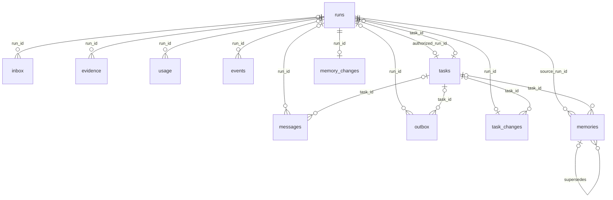

# Database structure and persistence

[简体中文](database.zh-CN.md) · [Documentation](../README.md)

Updated: 2026-10-02. Scope: the implemented schema after migrations 1–6 and the checkpoint saver installed from `uv.lock`. This is a source-level reference, not an inspection of an owner's live database.

## Storage ownership

PostgreSQL holds two groups of tables. Kestri owns 19 tables with vector support (18 without) in the `kestri` schema; LangGraph's `AsyncPostgresSaver` owns four checkpoint tables in `public`. Retrieved text lives separately in the application workspace. Database rows contain file identifiers and provenance, not full page bodies.

The authoritative business definitions are [001_initial.sql](../../src/kestri/storage/sql/001_initial.sql), [002_tasks.sql](../../src/kestri/storage/sql/002_tasks.sql), [003_memory_context.sql](../../src/kestri/storage/sql/003_memory_context.sql), and [004_data_lifecycle.sql](../../src/kestri/storage/sql/004_data_lifecycle.sql). [Store](../../src/kestri/storage/store.py) implements transactions; [DataService](../../src/kestri/storage/lifecycle.py) implements retention and logical backup.

| Storage | Contents | Why separate |
| --- | --- | --- |
| `kestri.messages` | Accepted inbound text and successfully delivered outbound text, after configured-secret redaction | An archive independent of model compression |
| `public.checkpoints`, blobs, writes | Graph state, messages, tool calls/results, middleware state, possibly provider reasoning | Execution state can be reset without deleting business records |
| `kestri.memories` | Explicitly retained owner facts/preferences | A fact needs provenance, scope, revocation, and expiry |
| `kestri.tasks` | Authorized recurring content and schedule | Model output alone cannot authorize recurring execution |
| `kestri.runs`, `outbox`, `usage` | Execution outcomes, durable delivery, and cost reservations | Completion, sending, and accounting have different commit points |
| `kestri.evidence` plus workspace | Source metadata and bounded retained source text | The model gets excerpts while originals remain inspectable within retention |

## Relationships and identity

This diagram shows selected physical foreign keys. Conversation heads and ownership checks are application-enforced associations, not foreign keys.

`chat_id` is the authorized owner's Telegram private-chat ID. It appears in several tables but does not reference `conversations` through a database constraint. Telegram update IDs, Telegram message IDs, archive IDs, run UUIDs, and graph thread IDs are distinct:

- `inbox.update_id` deduplicates provider updates.
- `messages.telegram_id` associates Telegram replies with an archived run result.
- `messages.id` is the local archive record ID used by `/history`.
- `runs.id` identifies one execution; background retries keep this run ID but use another graph thread.
- `conversations.thread_id` points to the latest completed foreground run's graph thread. It is nullable text, without a foreign key to `runs` or `public.checkpoints`.
- `memories.source_message_id` is a Telegram message ID, not a reference to `messages.id`.

The same database is bound to one bot/owner pair through `meta.identity`. This is a single-owner application, without database row-level security or a multi-tenant permission model.

## Table inventory

Unless noted otherwise, timestamps are `timestamptz`; creation timestamps default to `now()`. Optional fields may be SQL `NULL`. Enumerations below describe current values; some are enforced by `CHECK`, while others are application conventions.

### Metadata and conversation heads

| Table | Fields and types | Purpose and constraints |
| --- | --- | --- |
| `migrations` | `version integer` | Primary key; records applied business migration versions |
| `meta` | `key text`, `value jsonb` | Primary key `key`; value required |
| `conversations` | `chat_id bigint`, `thread_id text?`, `updated_at timestamptz`, `memory_epoch integer` | Primary key `chat_id`; epoch defaults to 0 |

Current `meta` keys are `identity` (bot/owner binding), `offset` (next Telegram update), `restore_quarantine` (startup must discard stale pending updates), and `maintenance` (last cleanup report or safe error type). These are business records, not model-visible memory.

### Execution runs

| Fields | Type / default | Meaning |
| --- | --- | --- |
| `id` | `uuid`, primary key | Execution identity |
| `chat_id`, `message_id` | Required `bigint` | Owner and triggering Telegram message; background runs use message ID 0 |
| `request`, `reply_to` | Required `text`, optional `bigint` | Accepted request or generated agreement prompt; optional replied-to message |
| `kind` | `text`, default `foreground` | Application values: `foreground`, `background`, `task_control`, `memory_control` |
| `status` | Required `text`, checked | `queued`, `running`, `completed`, `failed`, `cancelled`, `interrupted` |
| `cancel_requested` | `boolean`, default false | Durable cancellation flag |
| `source_thread` | Optional `text` | Prior completed foreground checkpoint to seed from |
| `memory_epoch` | `integer`, default 0 | Conversation epoch captured when claimed |
| `result`, `error_type` | Optional `text` | Saved outcome and safe failure classification |
| `task_id`, `task_revision` | Optional `uuid`, `integer` | Task foreign key and revision captured for an occurrence |
| `scheduled_for` | Optional timestamp | Logical scheduled occurrence in UTC |
| `available_at` | Timestamp, default `now()` | Earliest claim time, including retry delay |
| `attempt` | `integer`, default 1 | Background retry attempt |
| `history_expired` | `boolean`, default false | Request/result content has been expired |
| `created_at`, `started_at`, `finished_at` | Creation required; others optional | Lifecycle timestamps |

`kind`, `attempt`, and `task_revision` are not constrained to their application values by the migration SQL. Do not infer stronger database enforcement from Python validation.

### Acceptance, archive, and delivery

| Table | Fields | Keys and meaning |
| --- | --- | --- |
| `inbox` | `update_id bigint`, `chat_id bigint`, `message_id bigint`, `run_id uuid?`, `accepted_at` | Primary key `update_id`; optional run foreign key; durable deduplication record |
| `messages` | `id bigserial`, `chat_id bigint`, `telegram_id bigint?`, `direction text`, `content text`, `reply_to bigint?`, `run_id uuid?`, `task_id uuid?`, `created_at` | Primary key `id`; unique `(chat_id, direction, telegram_id)`; direction checked to `in`/`out`; optional run/task foreign keys |
| `outbox` | `sequence bigserial`, `id uuid`, `chat_id bigint`, `reply_to bigint?`, `run_id uuid?`, `task_id uuid?`, `content text`, `status text`, `attempts integer`, `error_type text?`, `next_attempt`, `created_at`, `telegram_id bigint?` | Primary key `id`; unique `sequence`; optional run/task foreign keys; `pending`/`sending`/`sent`/`failed`/`uncertain` checked; attempts defaults to 0 |

An acceptance transaction creates the deduplication record, archive row, optional run, and acknowledgement outbox row together. The polling cursor advances afterward; a crash between those commits can redeliver an update, which `inbox` rejects as a duplicate. Unauthorized updates do not enter these tables.

One result may generate several outbox rows: `chunks()` splits text into 3500-character parts. Delivery claims the earliest pending `sequence`; if its `next_attempt` is in the future, later pending rows wait. Successful delivery records the Telegram message ID and outbound archive row together. Saving a run result does not mean Telegram has received it.

### Recurring tasks and mutation acknowledgements

| Table | Fields | Keys and meaning |
| --- | --- | --- |
| `tasks` | `id uuid`, `chat_id bigint`, `title text`, `instructions text`, `timezone text`, `local_time text`, `weekdays integer[]`, `catch_up_seconds integer`, `status text`, `revision integer`, `next_due`, `authorized_run_id uuid`, `created_at`, `updated_at`, `restored boolean` | Primary key `id`; unique required authorizing-run foreign key; status checked to `active`/`paused`/`deleted`; catch-up checked to 0–86400; revision defaults to 1, restored to false |
| `task_changes` | `run_id uuid`, `task_id uuid?`, `action text`, `result text`, `created_at` | Run primary/foreign key; optional task foreign key; committed acknowledgement for idempotent mutation and recovery |

`timezone` is an IANA zone string, `local_time` is `HH:MM`, and `weekdays` uses Monday=0 through Sunday=6. The application validates these formats. `next_due` is an absolute UTC timestamp; local schedule fields remain the owner's agreement. Updates increment `revision` and invalidate queued occurrences under the old agreement.

The unique index `(task_id, scheduled_for)` prevents duplicate local occurrence rows. `tasks.authorized_run_id` and `runs.task_id` form a cycle; migration 4 makes both foreign keys deferrable for restore transactions. This does not give Telegram delivery an exactly-once guarantee.

### Explicit personal memory

| Table | Fields | Keys and meaning |
| --- | --- | --- |
| `memories` | `id uuid`, `chat_id bigint`, `content text`, `scope text`, `task_id uuid?`, `source_message_id bigint`, `source_run_id uuid`, `status text`, `supersedes uuid?`, `expires_at?`, `created_at`, `updated_at` | Primary key `id`; task/source-run/self foreign keys; scope checked to `global`/`task`; status checked to `active`/`superseded`/`forgotten`/`expired`/`quarantined` |
| `memory_changes` | `run_id uuid`, `result text`, `created_at` | Run primary/foreign key; committed command acknowledgement |

A check requires global memory to have no task and task memory to have a task. Corrections insert a new record pointing to the old one through `supersedes`; the old row becomes `superseded`. Forgetting changes status rather than immediately erasing every retained copy. The self-reference is deferrable for restore. [Context management](../design/context-management.md) explains epoch invalidation and ephemeral retrieval.

### Evidence, accounting, and events

| Table | Fields | Keys and meaning |
| --- | --- | --- |
| `evidence` | `id uuid`, `run_id uuid`, `kind text`, `url text`, `title text`, `status text`, `truncated boolean`, `metadata jsonb`, `created_at` | Primary key `id`; required run foreign key; application kinds include `search_snippet` and `page_extract`; statuses include `retrieved`, `failed`, `expired` |
| `usage` | `id uuid`, `run_id uuid`, `kind text`, `amount_micro_usd bigint`, `state text`, `metadata jsonb`, `created_at` | Primary key `id`; required run foreign key; amount checked nonnegative; state defaults to `reserved`, metadata to `{}` |
| `events` | `sequence bigserial`, `run_id uuid?`, `kind text`, `metadata jsonb`, `created_at` | Primary key `sequence`; optional run foreign key; operational observations, not full prompt traces |

`usage.kind` includes `model`, `summary`, `search`, and `extract`; `state` is `reserved`, `recorded`, or `unknown` by application convention. Integer micro-USD avoids floating-point currency arithmetic. Unknown requests retain their reservation amount. Events include context compression, rejected tools/URLs, and scheduling decisions; metadata is redacted.

Evidence text is stored at `<workspace>/<run UUID>/<evidence UUID>.txt`, at most 64,000 characters per retained item. Search snippets and extracted pages are distinct evidence types. Failed extraction has a metadata record but no successful text file. The default workspace is `.kestri/workspace`; Compose mounts it at `/workspace`.

## Indexes and query paths

| Index or key | Query / invariant |
| --- | --- |
| `kestri_runs_queue(status, created_at)` | Find oldest queued run; claim with `FOR UPDATE SKIP LOCKED` |
| `kestri_outbox_pending(status, next_attempt)` | Pending delivery filtering; ordering additionally uses unique `sequence` |
| `kestri_occurrence(task_id, scheduled_for)` | Unique occurrence identity; ordinary runs have null task fields |
| `kestri_memory_active(chat_id, status)` | Owner/status filtering before expiry/scope selection |
| Inbox primary key, archive unique key | Update deduplication and message association |
| Change-table primary keys, task authorizing-run uniqueness | No second mutation acknowledgement or second task from the same authorizing run |

There is no dedicated full-text or approximate-vector, `tasks.next_due`, or evidence-URL index. Most owner/task filtering is ordinary SQL plus bounded in-process ranking. The schema targets personal use; scale claims require query measurements and a separate indexing decision.

## Transactions and locking

| Boundary | What commits together / lock |
| --- | --- |
| Startup migrations | Business DDL in one transaction under `kestri-migrations`; saver setup is separate |
| Bot lease | Session advisory lock keyed by bot ID; held on a dedicated pooled connection; coordinates instances using this database |
| Acceptance and controls | Conversation row serialization; deduplication, archive, queued work/cancellation, and acknowledgement |
| Claim | Run row lock; status, starting timestamp, source checkpoint, and current epoch |
| Finish | Conversation then run locking; terminal result, unresolved usage classification, successful foreground head, and result outbox rows |
| Task or memory mutation | Owner conversation and relevant business rows; mutation plus run-keyed acknowledgement; final run finish is separate |
| Cost reservation | `kestri-budget` transaction advisory lock; check monthly/per-run totals and insert reservation |
| Maintenance | `kestri-data` transaction advisory lock; operator also checks bot lease; conversation rows locked for content changes |

A pool of 1–6 connections uses autocommit for standalone statements, explicit transactions for grouped operations, a 10-second statement timeout, and a 5-second lock timeout. Memory source quotes use cascade deletion on archive removal; other retained business foreign keys do not cascade. Content retention clears or marks dependent business rows deliberately, preserving identifiers and ledgers.

Database commit and external HTTP/file operations cannot form one atomic transaction. A file can become orphaned if its metadata insert fails; a send can succeed remotely before local confirmation. Recovery treats these gaps conservatively rather than claiming complete crash atomicity.

## Framework checkpoint tables

The locked checkpoint saver creates `public.checkpoint_migrations`, `public.checkpoints`, `public.checkpoint_blobs`, and `public.checkpoint_writes`. These are dependency-owned implementation details, not an application SQL API.

| Table | Key / important fields | Contents |
| --- | --- | --- |
| `checkpoint_migrations` | `v integer` primary key | Saver's own migration versions |
| `checkpoints` | Primary key `(thread_id, checkpoint_ns, checkpoint_id)`; `parent_checkpoint_id`, `type`, `checkpoint jsonb`, `metadata jsonb` | Snapshot identity, lineage, graph/channel version metadata |
| `checkpoint_blobs` | Primary key `(thread_id, checkpoint_ns, channel, version)`; `type`, `blob bytea?` | Serialized channel payloads, including messages |
| `checkpoint_writes` | Primary key `(thread_id, checkpoint_ns, checkpoint_id, task_id, idx)`; `channel`, `type`, `blob bytea`, `task_path` | Pending/intermediate graph writes |

Each of the three state tables also has a thread-ID index. Kestri uses run UUID text as the normal graph thread, and `<run UUID>-attempt-<attempt>` for a retried background execution. A checkpoint may exist for failed work; only a successfully completed foreground run promotes the conversation head. No automatic graph resume is performed on process restart.

## Migration and data lifecycle

`Store.open()` executes all eight idempotent migration files in order and inserts version records. It does not select only files absent from `migrations`, and there is no down-migration runner. Migration 1 introduces execution/delivery/evidence, 2 adds tasks, 3 adds memory and epochs, and 4 adds content expiration/restore markers and deferrable constraints. Treat incompatible changes as explicit migrations and review backup compatibility.

Logical backups contain 18 business tables (excluding `migrations`) and retrieved evidence text. They exclude all framework checkpoints and credentials. Restore requires an empty target, resets graph continuity, quarantines active memory, pauses tasks, interrupts unfinished work, and marks unfinished delivery uncertain. It does not restore a runnable crash image.

Cleanup can delete archived messages, clear request/result/acknowledgement bodies, expire evidence, and clear all graph state while idle. It retains IDs, deduplication, identity, and cost records. Read [data lifecycle](data-lifecycle.md) for exact retention and [backup and restore](../how-to/backup-and-restore.md) for operator procedures.

## Source and verification map

- Schema and transactions: migration files above and [store.py](../../src/kestri/storage/store.py).
- Task invariants: [tasks.py](../../src/kestri/tasks/service.py) and [task integration tests](../../tests/tasks/test_tasks_integration.py).
- Memory invariants: [memory.py](../../src/kestri/memory/service.py) and [memory/context integration tests](../../tests/memory/test_memory_context_integration.py).
- Persistence/delivery: [research integration tests](../../tests/agent/test_research_integration.py).
- Restore/retention: [data lifecycle integration tests](../../tests/storage/test_data_lifecycle_integration.py).

These database tests use a disposable `kestri_test` database and drop its business schema. Follow [run checks](../how-to/run-checks.md); do not point them at personal data.

## Automatic-memory migration 5

[005_automatic_memory.sql](../../src/kestri/storage/sql/005_automatic_memory.sql) adds conversation `auto_memory_enabled`, `memory_revision`, `memory_settings_generation`, `memory_activation_watermark`, `automatic_history_floor`; message `provenance` defaults to `legacy`, with new ingestion marking `direct`, `forwarded`, `external_reply` or outbound `context`. Memory adds `category`, `origin`, `revision`, `fact_key`, `valid_from`, `review_after`, `last_source_message_id` and `candidate` status. `last_source_message_id` is an archive ID; existing `source_message_id` remains a Telegram ID.

| Table | Important fields / invariants |
| --- | --- |
| `memory_jobs` | UUID `id`, owner, archive source, extractor version, settings generation, status, maintenance run, lease token/deadline, attempts, availability, captured revision/epoch, safe error, timestamps; unique source/version; archive deletion sets source null |
| `memory_sources` | Composite memory/archive primary key, exact quote and Unicode offsets; deferred foreign keys; archive deletion cascades quote removal |
| `memory_events` | Bigserial `id`, owner, memory/job references, operation and timestamp; no prompt text |

`kestri_memory_jobs_pending(chat_id,status,available_at)` supports maintenance scans. Owner conversation locks serialize controls/claims/publication; no model HTTP occurs under these transactions. Extraction cost kind is `memory_extract`, using the existing USD ledger. Backups include 16 business tables, excluding migration metadata. Repeated startup migrations preserve candidate states. These changes still contain no vector column or pgvector extension. [Job tests](../../tests/memory/test_memory_jobs_integration.py) verify transitions and conservative restore on disposable PostgreSQL.

## Semantic-memory migration 6

[006_semantic_memory.sql](../../src/kestri/storage/sql/006_semantic_memory.sql) adds conversation `memory_use_enabled` (true for ordinary upgrades), `memory_semantic_enabled` (false), `memory_retrieval_generation` and `memory_embedding_space`. `memory_index_jobs` contains UUID ID, owner/memory references, revision/content fingerprint/space/generation, status/run/lease/attempts/availability/safe error/times; uniqueness covers memory/revision/space/generation. `memory_embeddings`, when pgvector is available, contains memory reference, revision/hash/space, `public.vector(1024)` and timestamp; primary key is memory/space, memory deletion cascades. No approximate index is created.

`sync_memory_index` and its memory INSERT/UPDATE trigger enqueue facts atomically, delete stale vectors and cancel stale jobs/runs/reservations. Settings, ownership, temporal state, content version and leases are rechecked for publication and queries. There are 21 Kestri tables with vector support, 19 without; backups include 18 and omit migration metadata/derived vectors. Ordinary PostgreSQL remains supported. All eight migration files run idempotently; migration 6 can add its optional vector table after server extension installation. See [semantic runtime](semantic-memory.md) for deployment permissions and lifecycle.

Migration 7 adds optional rebuildable `history_embeddings` (source IDs/hashes, generations and vectors, without copied chat text); see the [history reference](../reference/history-retrieval.md). Logical backup is now schema 7 and omits fact/history vectors; restore requires empty derived indexes and disables auto/use/semantic. Source changes, run-history expiry, and settings/floors purge the historical cache.

Migration 8 adds persistent `history_index_jobs`; logical schema 7 includes this table while omitting vectors. Restore cancels historical jobs and fills an empty job table for schema 4/5/6. See the [history reference](../reference/history-retrieval.md) for budgets and leases.
