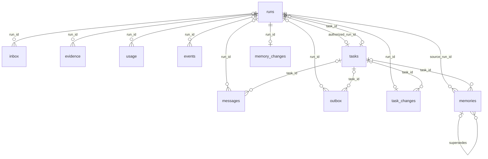

# 数据库结构与持久化

[English](database.md) · [文档指南](../README.zh-CN.md)

更新：2026-10-02。范围：迁移 1–4 完成后的实际结构，以及从 `uv.lock` 安装的 checkpoint saver。这是源码级参考，不代表检查了主人的运行数据库。

## 存储归属

PostgreSQL 中有两组表。Kestri 在 `kestri` schema 中维护 14 张表；LangGraph 的 `AsyncPostgresSaver` 在 `public` 中维护 4 张 checkpoint 表。获取的正文另存于应用工作区。数据库保存文件标识和来源信息，不保存完整网页正文。

业务结构以 [001_initial.sql](../../src/kestri/sql/001_initial.sql)、[002_tasks.sql](../../src/kestri/sql/002_tasks.sql)、[003_memory_context.sql](../../src/kestri/sql/003_memory_context.sql) 和 [004_data_lifecycle.sql](../../src/kestri/sql/004_data_lifecycle.sql) 为准。[Store](../../src/kestri/store.py) 实现事务；[DataService](../../src/kestri/data.py) 实现保留策略和逻辑备份。

| 存储 | 内容 | 为什么分开 |
| --- | --- | --- |
| `kestri.messages` | 已接受的输入与成功发送的输出，经过配置秘密脱敏 | 原始归档独立于模型压缩 |
| `public.checkpoints`、blobs、writes | 图状态、消息、工具调用与结果、中间件状态，可能包括模型推理字段 | 重置执行状态不必删除业务记录 |
| `kestri.memories` | 主人明确要求保留的事实和偏好 | 事实需要来源、范围、撤销与到期规则 |
| `kestri.tasks` | 已授权的持续内容与时间约定 | 模型输出本身不能授权持续执行 |
| `kestri.runs`、`outbox`、`usage` | 执行结果、持久投递与费用预留 | 完成、发送和计费有不同提交点 |
| `kestri.evidence` 与工作区 | 来源元数据及有界原文 | 模型接收节选，保留期内原文仍可检查 |

## 关系与标识

图中展示主要的实际外键。对话头与主人归属由应用校验，不是数据库外键。

`chat_id` 是已授权主人的 Telegram 私聊 ID。多张表都保存它，但没有通过数据库约束引用 `conversations`。Telegram update ID、Telegram message ID、归档 ID、run UUID 与图 thread ID 是不同标识：

- `inbox.update_id` 对服务端更新去重。
- `messages.telegram_id` 将 Telegram 回复关联到已归档执行结果。
- `messages.id` 是 `/history` 使用的本地归档记录 ID。
- `runs.id` 标识一次执行；后台重试保留此 ID，但换用新的图 thread。
- `conversations.thread_id` 指向最近成功完成的前台 run 对应的图 thread。它是可空文本，没有引用 `runs` 或 `public.checkpoints` 的外键。
- `memories.source_message_id` 是 Telegram message ID，不是 `messages.id` 的引用。

`meta.identity` 将同一个数据库绑定到一组 bot/owner。当前是单主人应用，没有数据库行级安全或多租户权限模型。

## 表清单

除非特别说明，时间字段都是 `timestamptz`，创建时间默认 `now()`。可选字段允许 SQL `NULL`。以下枚举描述当前取值；部分由 `CHECK` 强制，部分只是应用约定。

### 元数据与对话头

| 表 | 字段与类型 | 用途和约束 |
| --- | --- | --- |
| `migrations` | `version integer` | 主键；记录业务迁移版本 |
| `meta` | `key text`、`value jsonb` | `key` 为主键；value 必填 |
| `conversations` | `chat_id bigint`、`thread_id text?`、`updated_at timestamptz`、`memory_epoch integer` | `chat_id` 为主键；epoch 默认 0 |

当前 `meta` key 包括 `identity`（bot/owner 绑定）、`offset`（下一条 Telegram 更新）、`restore_quarantine`（启动需跳过陈旧待处理更新）和 `maintenance`（最近清理报告或安全错误类型）。这些是业务记录，不是模型可见记忆。

### 执行记录

| 字段 | 类型 / 默认值 | 含义 |
| --- | --- | --- |
| `id` | `uuid`，主键 | 执行标识 |
| `chat_id`、`message_id` | 必填 `bigint` | 主人与触发消息；后台执行的 message ID 为 0 |
| `request`、`reply_to` | 必填 `text`、可选 `bigint` | 已接受请求或从约定生成的提示；可选被回复消息 |
| `kind` | `text`，默认 `foreground` | 应用取值：`foreground`、`background`、`task_control`、`memory_control` |
| `status` | 必填 `text`，有检查约束 | `queued`、`running`、`completed`、`failed`、`cancelled`、`interrupted` |
| `cancel_requested` | `boolean`，默认 false | 持久取消标记 |
| `source_thread` | 可选 `text` | 用于初始化的上一条成功前台 checkpoint |
| `memory_epoch` | `integer`，默认 0 | 领取执行时捕获的对话代次 |
| `result`、`error_type` | 可选 `text` | 已保存结果与安全错误分类 |
| `task_id`、`task_revision` | 可选 `uuid`、`integer` | 任务外键与本次 occurrence 捕获的版本 |
| `scheduled_for` | 可选时间戳 | 本次逻辑计划时刻，UTC |
| `available_at` | 时间戳，默认 `now()` | 最早领取时间，含重试延迟 |
| `attempt` | `integer`，默认 1 | 后台尝试次数 |
| `history_expired` | `boolean`，默认 false | 请求与结果内容是否已过期 |
| `created_at`、`started_at`、`finished_at` | 创建时间必填，其他可选 | 生命周期时间戳 |

迁移 SQL 没有将 `kind`、`attempt` 和 `task_revision` 限定为应用取值。不能把 Python 校验理解成更强的数据库约束。

### 接收、归档与投递

| 表 | 字段 | 键与含义 |
| --- | --- | --- |
| `inbox` | `update_id bigint`、`chat_id bigint`、`message_id bigint`、`run_id uuid?`、`accepted_at` | `update_id` 主键；可选 run 外键；持久去重记录 |
| `messages` | `id bigserial`、`chat_id bigint`、`telegram_id bigint?`、`direction text`、`content text`、`reply_to bigint?`、`run_id uuid?`、`task_id uuid?`、`created_at` | `id` 主键；`(chat_id, direction, telegram_id)` 唯一；direction 限定 `in`/`out`；可选 run/task 外键 |
| `outbox` | `sequence bigserial`、`id uuid`、`chat_id bigint`、`reply_to bigint?`、`run_id uuid?`、`task_id uuid?`、`content text`、`status text`、`attempts integer`、`error_type text?`、`next_attempt`、`created_at`、`telegram_id bigint?` | `id` 主键；`sequence` 唯一；可选 run/task 外键；状态限定 `pending`/`sending`/`sent`/`failed`/`uncertain`；attempts 默认 0 |

接收事务一起创建去重记录、归档、可选执行和确认 outbox。轮询游标随后推进；若在两个提交点之间崩溃，更新可能重新到达，但 `inbox` 会拒绝重复。未授权更新不进入这些表。

一个结果可产生多条 outbox：`chunks()` 按 3500 字符分块。发送领取最早的 pending `sequence`；若其 `next_attempt` 还没到，后面的 pending 消息等待。发送成功一起记录 Telegram message ID 和出站归档。保存 run 结果不代表 Telegram 已收到。

### 持续任务与变更回执

| 表 | 字段 | 键与含义 |
| --- | --- | --- |
| `tasks` | `id uuid`、`chat_id bigint`、`title text`、`instructions text`、`timezone text`、`local_time text`、`weekdays integer[]`、`catch_up_seconds integer`、`status text`、`revision integer`、`next_due`、`authorized_run_id uuid`、`created_at`、`updated_at`、`restored boolean` | `id` 主键；授权 run 外键必填且唯一；状态限定 `active`/`paused`/`deleted`；catch-up 限定 0–86400；revision 默认 1，restored 默认 false |
| `task_changes` | `run_id uuid`、`task_id uuid?`、`action text`、`result text`、`created_at` | run 主键兼外键；可选 task 外键；已提交回执用于幂等变更与恢复 |

`timezone` 是 IANA 时区字符串，`local_time` 是 `HH:MM`，`weekdays` 为周一=0 至周日=6。格式由应用校验。`next_due` 是绝对 UTC 时间；本地调度字段仍是主人的约定。修改会递增 `revision`，使旧约定下的排队执行失效。

唯一索引 `(task_id, scheduled_for)` 阻止本地重复 occurrence。`tasks.authorized_run_id` 与 `runs.task_id` 形成循环；迁移 4 将两个外键设为可延迟检查，以支持恢复事务。这不等于 Telegram 恰好发送一次。

### 显式个人记忆

| 表 | 字段 | 键与含义 |
| --- | --- | --- |
| `memories` | `id uuid`、`chat_id bigint`、`content text`、`scope text`、`task_id uuid?`、`source_message_id bigint`、`source_run_id uuid`、`status text`、`supersedes uuid?`、`expires_at?`、`created_at`、`updated_at` | `id` 主键；task/source-run/自身外键；scope 限定 `global`/`task`；状态限定 `active`/`superseded`/`forgotten`/`expired`/`quarantined` |
| `memory_changes` | `run_id uuid`、`result text`、`created_at` | run 主键兼外键；已提交的命令回执 |

检查约束要求全局记忆没有 task，任务记忆必须有 task。纠正插入新记录，通过 `supersedes` 指向旧记录，旧记录变为 `superseded`。忘记改变状态，不会立即清除全部保留副本。自身外键可延迟检查以支持恢复。[上下文管理](../design/context-management.zh-CN.md)解释代次失效与临时检索注入。

### 证据、计费与事件

| 表 | 字段 | 键与含义 |
| --- | --- | --- |
| `evidence` | `id uuid`、`run_id uuid`、`kind text`、`url text`、`title text`、`status text`、`truncated boolean`、`metadata jsonb`、`created_at` | `id` 主键；run 外键必填；应用类型包括 `search_snippet` 和 `page_extract`；状态包括 `retrieved`、`failed`、`expired` |
| `usage` | `id uuid`、`run_id uuid`、`kind text`、`amount_micro_usd bigint`、`state text`、`metadata jsonb`、`created_at` | `id` 主键；run 外键必填；金额非负；state 默认 `reserved`，metadata 默认 `{}` |
| `events` | `sequence bigserial`、`run_id uuid?`、`kind text`、`metadata jsonb`、`created_at` | `sequence` 主键；可选 run 外键；记录运行观察，不是完整提示词 trace |

`usage.kind` 包括 `model`、`summary`、`search` 和 `extract`；应用约定的 `state` 为 `reserved`、`recorded` 或 `unknown`。整数微美元避免浮点货币计算。未知请求继续保留预留金额。事件包括上下文压缩、工具/URL 拒绝和调度决策；元数据经过脱敏。

证据正文位于 `<workspace>/<run UUID>/<evidence UUID>.txt`，每项最多保留 64,000 字符。搜索摘要与网页提取是不同证据类型。提取失败有元数据记录，没有成功正文文件。默认工作区为 `.kestri/workspace`；Compose 挂载到 `/workspace`。

## 索引与查询路径

| 索引或键 | 查询 / 不变量 |
| --- | --- |
| `kestri_runs_queue(status, created_at)` | 查找最早排队执行；用 `FOR UPDATE SKIP LOCKED` 领取 |
| `kestri_outbox_pending(status, next_attempt)` | 筛选待发送消息；排序另用唯一 `sequence` |
| `kestri_occurrence(task_id, scheduled_for)` | occurrence 唯一标识；普通执行的任务字段为空 |
| `kestri_memory_active(chat_id, status)` | 到期/范围筛选前的主人和状态筛选 |
| Inbox 主键、归档唯一键 | 更新去重与消息关联 |
| 变更表主键、授权 run 唯一性 | 同一授权执行不重复创建任务或变更回执 |

没有专门的全文、向量、`tasks.next_due` 或 evidence URL 索引。多数主人/任务筛选使用普通 SQL，再做有界内存排序。结构面向个人使用；规模结论需要查询测量和单独的索引决策。

## 事务与锁

| 边界 | 一起提交的内容 / 锁 |
| --- | --- |
| 启动迁移 | `kestri-migrations` 下单事务执行业务 DDL；saver setup 单独运行 |
| Bot 租约 | 按 bot ID 的 session advisory lock；专用池连接持续持有；协调使用同一数据库的实例 |
| 接收与控制 | 对话行串行化；去重、归档、排队执行/取消与确认 |
| 领取 | 执行行锁；状态、开始时间、来源 checkpoint 和当前 epoch |
| 完成 | 先锁对话再锁 run；最终结果、未结算费用分类、成功前台头与结果 outbox |
| 任务或记忆变更 | 主人对话及相关业务行；变更与 run 回执一起提交；run 完成单独提交 |
| 费用预留 | `kestri-budget` 事务 advisory lock；检查月度/单次合计并插入预留 |
| 数据维护 | `kestri-data` 事务 advisory lock；操作员另检查 bot 租约；内容变化时锁对话行 |

连接池使用 1–6 条连接，独立语句 autocommit，组合操作显式事务，语句超时 10 秒，锁超时 5 秒。外键没有自动级联删除。内容保留操作有意清空或标记依赖记录，保留标识和账本。

数据库提交与外部 HTTP/文件操作无法成为一个原子事务。文件写完后元数据插入失败可留下孤立文件；远端发送成功可能发生在本地确认前。恢复保守处理这些间隙，不宣称完整的崩溃原子性。

## 框架 checkpoint 表

锁定的 checkpoint saver 创建 `public.checkpoint_migrations`、`public.checkpoints`、`public.checkpoint_blobs` 和 `public.checkpoint_writes`。它们属于依赖内部实现，不是应用 SQL API。

| 表 | 键 / 重要字段 | 内容 |
| --- | --- | --- |
| `checkpoint_migrations` | `v integer` 主键 | saver 自己的迁移版本 |
| `checkpoints` | `(thread_id, checkpoint_ns, checkpoint_id)` 主键；`parent_checkpoint_id`、`type`、`checkpoint jsonb`、`metadata jsonb` | 快照标识、父子关系、图与 channel 版本元数据 |
| `checkpoint_blobs` | `(thread_id, checkpoint_ns, channel, version)` 主键；`type`、`blob bytea?` | 序列化 channel 载荷，包括消息 |
| `checkpoint_writes` | `(thread_id, checkpoint_ns, checkpoint_id, task_id, idx)` 主键；`channel`、`type`、`blob bytea`、`task_path` | 待处理/中间图写入 |

三张状态表另有 thread ID 索引。Kestri 普通图 thread 使用 run UUID 文本，后台重试使用 `<run UUID>-attempt-<attempt>`。失败执行也可能已有 checkpoint；只有成功前台 run 会推进对话头。进程重启不会自动恢复图执行。

## 迁移与数据生命周期

`Store.open()` 按顺序执行全部四份幂等迁移文件并记录版本。它不是只执行 `migrations` 中缺失的文件，也没有向下迁移器。迁移 1 引入执行/投递/证据，2 增加任务，3 增加记忆与 epoch，4 增加内容过期/恢复标记与可延迟外键。不兼容修改需要显式迁移并审查备份兼容性。

逻辑备份包含 13 张业务表（不含 `migrations`）和成功获取的证据正文，不含任何框架 checkpoint 或凭据。恢复要求空目标，重置图连续性，隔离有效记忆、暂停任务、中断未完成执行、将未完成投递标记为不确定。它不会恢复可继续执行的崩溃现场。

清理可删除消息归档，清空请求/结果/回执正文，使证据过期，并在空闲时清空全部图状态。标识、去重、身份和费用记录保留。准确保留规则见[数据生命周期](data-lifecycle.zh-CN.md)，操作流程见[备份恢复](../how-to/backup-and-restore.zh-CN.md)。

## 源码与验证地图

- 结构与事务：上方迁移文件及 [store.py](../../src/kestri/store.py)。
- 任务不变量：[tasks.py](../../src/kestri/tasks.py) 与[任务集成测试](../../tests/test_tasks_integration.py)。
- 记忆不变量：[memory.py](../../src/kestri/memory.py) 与[记忆/上下文集成测试](../../tests/test_memory_context_integration.py)。
- 持久化与投递：[研究集成测试](../../tests/test_research_integration.py)。
- 恢复与保留：[数据生命周期集成测试](../../tests/test_data_lifecycle_integration.py)。

数据库测试使用可丢弃的 `kestri_test` 并删除其业务 schema。遵循[运行检查](../how-to/run-checks.zh-CN.md)，不能指向个人数据。
